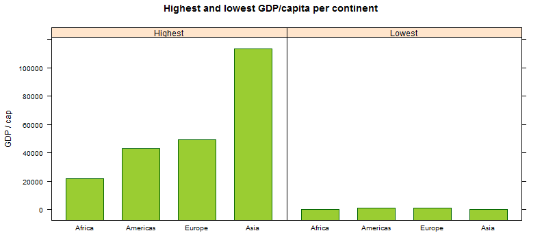
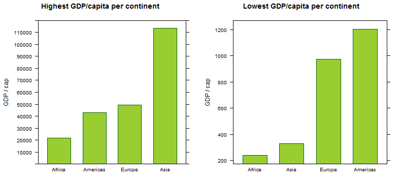
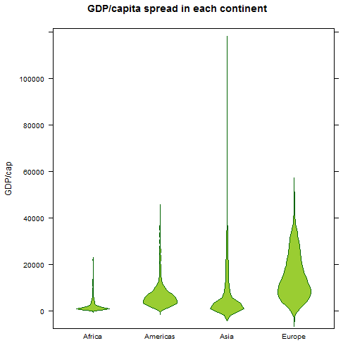
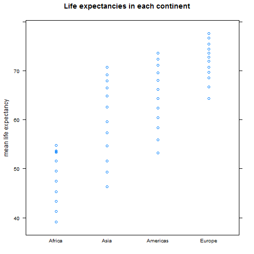
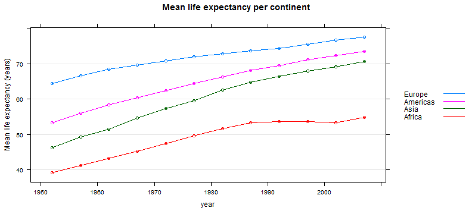

Dean Attali
=================================
**STAT 545A hw 4**  
**Sept 28 2013**

In this assignment, I will take data aggregation code written by other students, and create visuals that will complement their tabular data.  The two students' work I will be using are [**Rebecca Johnston**](http://rpubs.com/rljohn/stat545a-2013-hw03_johnston-reb) and [**Daniel Dinsdale**](http://rpubs.com/danieldinsdale/stat545a-2013-hw03_dinsdale-dan).

### Data initialization


```r
# load required libraries
library(plyr)
library(lattice)
library(xtable)
# import the data
gDat <- read.delim("gapminderDataFiveYear.txt")
# sanity check that import was successful
str(gDat)
```

```
## 'data.frame':	1704 obs. of  6 variables:
##  $ country  : Factor w/ 142 levels "Afghanistan",..: 1 1 1 1 1 1 1 1 1 1 ...
##  $ year     : int  1952 1957 1962 1967 1972 1977 1982 1987 1992 1997 ...
##  $ pop      : num  8425333 9240934 10267083 11537966 13079460 ...
##  $ continent: Factor w/ 5 levels "Africa","Americas",..: 3 3 3 3 3 3 3 3 3 3 ...
##  $ lifeExp  : num  28.8 30.3 32 34 36.1 ...
##  $ gdpPercap: num  779 821 853 836 740 ...
```

```r
# drop Oceania because it has almost no data
nlevels(gDat$continent)
```

```
## [1] 5
```

```r
gDat <- droplevels(subset(gDat, continent != 'Oceania'))
nlevels(gDat$continent)
```

```
## [1] 4
```


### Looking at every continent's min/max GDP in tall format (Rebecca)
Rebecca wrote some code to get her the minimum and maximum GDP/capita in each continent. Here it is.

```r
# ----- THE FOLLOWING PIECE OF CODE IS TAKEN FROM REBECCA

# Write own function to produce a data frame in tall format
minmax <- function(x) {
  ## Make character vector to specify min and max
  factor = c("Min", "Max")
  ## Specify function to compute min and max (same order as line above)
  value = c(min(x$gdpPercap), max(x$gdpPercap))
  ## Make factor and value two columns in a data frame
  data.frame(factor, value)
}
# Use ddply to apply the function by continent
contMinMaxGdpTall <- ddply(gDat, ~continent, minmax)
```


Let's look at the table that Rebecca's code produces. It shows, in tall format, the minimum and maximum GDP/cap of each continent.


```r
contMinMaxGdpTall <- xtable(contMinMaxGdpTall)
print(contMinMaxGdpTall, type = "html", include.rownames = FALSE)
```

<!-- html table generated in R 3.0.1 by xtable 1.7-1 package -->
<!-- Sun Sep 29 00:17:31 2013 -->
<TABLE border=1>
<TR> <TH> continent </TH> <TH> factor </TH> <TH> value </TH>  </TR>
  <TR> <TD> Africa </TD> <TD> Min </TD> <TD align="right"> 241.17 </TD> </TR>
  <TR> <TD> Africa </TD> <TD> Max </TD> <TD align="right"> 21951.21 </TD> </TR>
  <TR> <TD> Americas </TD> <TD> Min </TD> <TD align="right"> 1201.64 </TD> </TR>
  <TR> <TD> Americas </TD> <TD> Max </TD> <TD align="right"> 42951.65 </TD> </TR>
  <TR> <TD> Asia </TD> <TD> Min </TD> <TD align="right"> 331.00 </TD> </TR>
  <TR> <TD> Asia </TD> <TD> Max </TD> <TD align="right"> 113523.13 </TD> </TR>
  <TR> <TD> Europe </TD> <TD> Min </TD> <TD align="right"> 973.53 </TD> </TR>
  <TR> <TD> Europe </TD> <TD> Max </TD> <TD align="right"> 49357.19 </TD> </TR>
   </TABLE>


This table looks like it contains good information, but it's a little bit hard to extract it ouf of it just by looking at the table. Let's try to visualize this data as a bar graph. Since we have two statistics for every continent, Max and Min, we will make two bar graphs, one for each of these.


```r
barchart(value ~ reorder(continent, value) | factor, contMinMaxGdpTall,
         ylab = "GDP / cap",
         strip = strip.custom(factor.levels = c("Highest","Lowest")),
         main = "Highest and lowest GDP/capita per continent",
         col = "yellowgreen",
         border = "darkgreen"
)
```

 

All the parameters to the barchart are fairly self-explanatory. I didn't like the names "Max" and "Min" as labels, so I changed them to "Highest" and "Lowest".
From these charts, we can clearly see that Africa has the lowest highest GDP/cap (if that sounds confusing, read it again), and that Asia has at least one country that is way twice as rich as the richest country in the rest of the continents. That looks interesting, I want to know what country that is.

```r
gDat[which(gDat$gdpPercap == max(contMinMaxGdpTall$value)),]
```

```
##     country year    pop continent lifeExp gdpPercap
## 854  Kuwait 1957 212846      Asia   58.03    113523
```

So Kuwait in 1957 was amazingly rich! Oil I guess?  
The next thing to notice about these charts is that it looks as though the lowest GDP/cap in all the continents is roughly the same. The visual here is misleading because what is happening is that the scale of the chart on the left is so big that it makes all the points on the other chart bunch up.  To get a better picture of what is happening on the lowest GDP/cap countries of each continent, it would be better to break the graphs up into two separate graphs.  
_Note: There might be a way to just change the scale of the separate panels, but I will show the use of the split panels function regardless_

```r
# these first two lines are to figure out how many tick lines to show in the y axis
numTicksFactor = 10000
numTicks = ceiling(max(contMinMaxGdpTall$value) / numTicksFactor)

# crate a Trellis object for the bar graph of the heighest GDP stat
highestGdpBarchart <-
  barchart(value ~ reorder(continent, value), contMinMaxGdpTall,
   subset = (factor == 'Max'),
   ylab = "GDP / cap",
   ylim = c(0, numTicks * numTicksFactor), # range of the y axis
   scales = list(tick.number = numTicks), # where to show ticks along the axis
   panel = function(...){
     panel.barchart(...)
     # I commented the next line out because I initially wanted to add grid lines
     #panel.grid = panel.grid(h = -(numTicks/2), v = FALSE)
   },
   col = "yellowgreen",
   border="darkgreen",
   main = "Highest GDP/capita per continent"
)
# create a Trellis object for the bar graph of the lowest GDP stat
lowestGdpBarchart <- barchart(value ~ reorder(continent, value, min), contMinMaxGdpTall,
                              subset = (factor == 'Min'),
                              ylab = "GDP / cap",
                              col = "yellowgreen",
                              border="darkgreen",
                              main = "Lowest GDP/capita per continent"
                     )
# plot the two bar graphs on the same panel
plot(highestGdpBarchart, split = c(1, 1, 2, 1))
plot(lowestGdpBarchart, split = c(2, 1, 2, 1), newpage = FALSE)
```

 

Ah, much better! Now we can actually read the lowest GDP/cap graph.  
Looking at the two graphs side by side reveals some interesting information.  First, we can see that Africa has the worst of both - its highest GDP country is lower than all other continents, and it also has the poorest country in the world. Another interesting thing to note is that Asia seems to have a very dramatic difference between its rich and poor countries, since its richest country is by far richer than the rest, yet its poorest is almost as poor as Africa's.
It's important to not forget that we're only looking at the extremes here (highest and lowest GDP in each continent).  
Just to put things in perspective, we should look at the density of the GDP of all countries in each continent.

```r
bwplot(gdpPercap ~ continent, gDat,
       panel = panel.violin,
       col = "yellowgreen", border = "darkgreen",
       main = "GDP/capita spread in each continent", ylab = "GDP/cap")
```

 

Now we can see that not all of Asia is as rich as Kuwait; in fact, most of Europe and the Americas are doing much better than most of Asia. Just good to see the big picture again.


### Looking at the mean life expectancy of each continent per year (Daniel)
Daniel wrote a one-liner to calculate the mean life expectancy of each continent for every year of data we have.

```r
# ----- THE FOLLOWING PIECE OF CODE IS TAKEN FROM DANIEL
contLifeExp <- ddply(gDat, continent ~ year, summarise, meanLifeExp = mean(lifeExp))
```

First, let's examine the data in a tabular format


```r
contLifeExp <- xtable(contLifeExp)
print(contLifeExp, type = "html", include.rownames = FALSE)
```

<!-- html table generated in R 3.0.1 by xtable 1.7-1 package -->
<!-- Sun Sep 29 00:17:32 2013 -->
<TABLE border=1>
<TR> <TH> continent </TH> <TH> year </TH> <TH> meanLifeExp </TH>  </TR>
  <TR> <TD> Africa </TD> <TD align="right"> 1952 </TD> <TD align="right"> 39.14 </TD> </TR>
  <TR> <TD> Africa </TD> <TD align="right"> 1957 </TD> <TD align="right"> 41.27 </TD> </TR>
  <TR> <TD> Africa </TD> <TD align="right"> 1962 </TD> <TD align="right"> 43.32 </TD> </TR>
  <TR> <TD> Africa </TD> <TD align="right"> 1967 </TD> <TD align="right"> 45.33 </TD> </TR>
  <TR> <TD> Africa </TD> <TD align="right"> 1972 </TD> <TD align="right"> 47.45 </TD> </TR>
  <TR> <TD> Africa </TD> <TD align="right"> 1977 </TD> <TD align="right"> 49.58 </TD> </TR>
  <TR> <TD> Africa </TD> <TD align="right"> 1982 </TD> <TD align="right"> 51.59 </TD> </TR>
  <TR> <TD> Africa </TD> <TD align="right"> 1987 </TD> <TD align="right"> 53.34 </TD> </TR>
  <TR> <TD> Africa </TD> <TD align="right"> 1992 </TD> <TD align="right"> 53.63 </TD> </TR>
  <TR> <TD> Africa </TD> <TD align="right"> 1997 </TD> <TD align="right"> 53.60 </TD> </TR>
  <TR> <TD> Africa </TD> <TD align="right"> 2002 </TD> <TD align="right"> 53.33 </TD> </TR>
  <TR> <TD> Africa </TD> <TD align="right"> 2007 </TD> <TD align="right"> 54.81 </TD> </TR>
  <TR> <TD> Americas </TD> <TD align="right"> 1952 </TD> <TD align="right"> 53.28 </TD> </TR>
  <TR> <TD> Americas </TD> <TD align="right"> 1957 </TD> <TD align="right"> 55.96 </TD> </TR>
  <TR> <TD> Americas </TD> <TD align="right"> 1962 </TD> <TD align="right"> 58.40 </TD> </TR>
  <TR> <TD> Americas </TD> <TD align="right"> 1967 </TD> <TD align="right"> 60.41 </TD> </TR>
  <TR> <TD> Americas </TD> <TD align="right"> 1972 </TD> <TD align="right"> 62.39 </TD> </TR>
  <TR> <TD> Americas </TD> <TD align="right"> 1977 </TD> <TD align="right"> 64.39 </TD> </TR>
  <TR> <TD> Americas </TD> <TD align="right"> 1982 </TD> <TD align="right"> 66.23 </TD> </TR>
  <TR> <TD> Americas </TD> <TD align="right"> 1987 </TD> <TD align="right"> 68.09 </TD> </TR>
  <TR> <TD> Americas </TD> <TD align="right"> 1992 </TD> <TD align="right"> 69.57 </TD> </TR>
  <TR> <TD> Americas </TD> <TD align="right"> 1997 </TD> <TD align="right"> 71.15 </TD> </TR>
  <TR> <TD> Americas </TD> <TD align="right"> 2002 </TD> <TD align="right"> 72.42 </TD> </TR>
  <TR> <TD> Americas </TD> <TD align="right"> 2007 </TD> <TD align="right"> 73.61 </TD> </TR>
  <TR> <TD> Asia </TD> <TD align="right"> 1952 </TD> <TD align="right"> 46.31 </TD> </TR>
  <TR> <TD> Asia </TD> <TD align="right"> 1957 </TD> <TD align="right"> 49.32 </TD> </TR>
  <TR> <TD> Asia </TD> <TD align="right"> 1962 </TD> <TD align="right"> 51.56 </TD> </TR>
  <TR> <TD> Asia </TD> <TD align="right"> 1967 </TD> <TD align="right"> 54.66 </TD> </TR>
  <TR> <TD> Asia </TD> <TD align="right"> 1972 </TD> <TD align="right"> 57.32 </TD> </TR>
  <TR> <TD> Asia </TD> <TD align="right"> 1977 </TD> <TD align="right"> 59.61 </TD> </TR>
  <TR> <TD> Asia </TD> <TD align="right"> 1982 </TD> <TD align="right"> 62.62 </TD> </TR>
  <TR> <TD> Asia </TD> <TD align="right"> 1987 </TD> <TD align="right"> 64.85 </TD> </TR>
  <TR> <TD> Asia </TD> <TD align="right"> 1992 </TD> <TD align="right"> 66.54 </TD> </TR>
  <TR> <TD> Asia </TD> <TD align="right"> 1997 </TD> <TD align="right"> 68.02 </TD> </TR>
  <TR> <TD> Asia </TD> <TD align="right"> 2002 </TD> <TD align="right"> 69.23 </TD> </TR>
  <TR> <TD> Asia </TD> <TD align="right"> 2007 </TD> <TD align="right"> 70.73 </TD> </TR>
  <TR> <TD> Europe </TD> <TD align="right"> 1952 </TD> <TD align="right"> 64.41 </TD> </TR>
  <TR> <TD> Europe </TD> <TD align="right"> 1957 </TD> <TD align="right"> 66.70 </TD> </TR>
  <TR> <TD> Europe </TD> <TD align="right"> 1962 </TD> <TD align="right"> 68.54 </TD> </TR>
  <TR> <TD> Europe </TD> <TD align="right"> 1967 </TD> <TD align="right"> 69.74 </TD> </TR>
  <TR> <TD> Europe </TD> <TD align="right"> 1972 </TD> <TD align="right"> 70.78 </TD> </TR>
  <TR> <TD> Europe </TD> <TD align="right"> 1977 </TD> <TD align="right"> 71.94 </TD> </TR>
  <TR> <TD> Europe </TD> <TD align="right"> 1982 </TD> <TD align="right"> 72.81 </TD> </TR>
  <TR> <TD> Europe </TD> <TD align="right"> 1987 </TD> <TD align="right"> 73.64 </TD> </TR>
  <TR> <TD> Europe </TD> <TD align="right"> 1992 </TD> <TD align="right"> 74.44 </TD> </TR>
  <TR> <TD> Europe </TD> <TD align="right"> 1997 </TD> <TD align="right"> 75.51 </TD> </TR>
  <TR> <TD> Europe </TD> <TD align="right"> 2002 </TD> <TD align="right"> 76.70 </TD> </TR>
  <TR> <TD> Europe </TD> <TD align="right"> 2007 </TD> <TD align="right"> 77.65 </TD> </TR>
   </TABLE>

This table is very long, and extracting information by looking at it is not going to be fun or easy. Looks like we need to make some pretty pictures!  
First, let's see what the distribution of life expectancies in each of the continents is.

```r
stripplot(meanLifeExp ~ reorder(continent, meanLifeExp), contLifeExp,
          ylab = 'mean life expectancy', main = 'Life expectancies in each continent')
```

 

This is already a much nicer way to look at this data. We can easily see that Africa has the lowest life expectancies, and Europe has the highest. It would be nice to compare the continents at each given time, or to see if the life expectancies are generally increasing with time. From this graph we can only see what the different expectancies for a continent are, but we are losing the time dimension. However, this is a very nice, simple start and gives us a general idea of what's going on.  
Now let's add the time dimension

```r
# reorder the continents so that the legend on the right will match the position of the lines
contLifeExp <- within(contLifeExp, continent <- reorder(continent,-meanLifeExp))
xyplot(meanLifeExp ~ year, contLifeExp,
       groups = continent,
       type = c("a", "p"),
       grid = "h",
       auto.key = list(lines = TRUE, points = FALSE, space = "right"), # make the legend prettier
       ylab = 'Mean life expectancy (years)',
       main = 'Mean life expectancy per continent'
)
```

 

From this plot, we can see that life expectancy is indeed increasing with time in all continents, except for Africa in the late 1990's. That's an intereting observation. We can also very clearly see how Europe is consistently healthier than America, which is consistently healthier than Asia.  Another thing to note is how America and Asia closed the gap a little bit between themselves and Europe since 1952, and that nowadays Africa is lagging behind more so than it ever did.
