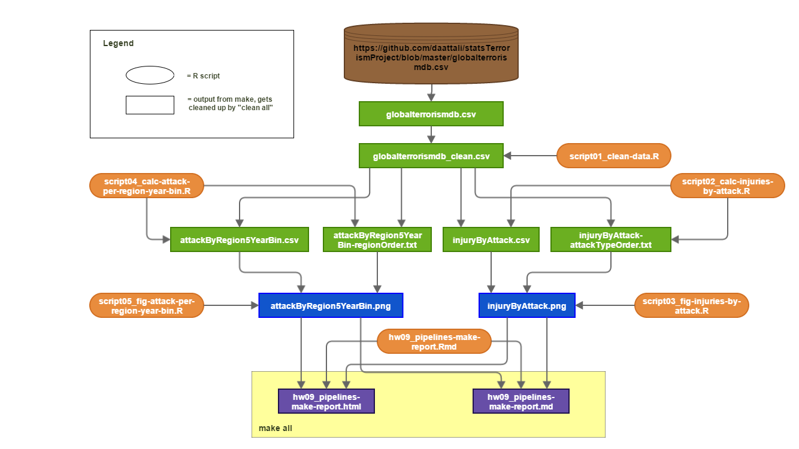

# Homework 09

How to use `make` to automate pipelines.  
  
--- 

### Overview
Initially, I wanted to use a cool new dataset from the web, but it was difficult finding a dataset that a. I found very interesting and b. was easily accessible via a URL (ie. did not involve clicking buttons/logging in/etc.).  Then I remembered that I have a copy of an [interesting dataset from last year's course](../../terrorism-project/globalterrorismdb.csv) about global terrorist attacks since 1970, so I will use that as my dataset.  

I have developed a short pipeline that begins with downloading the raw data, cleans the data, produces several tabular results in `csv` format, generates a couple images using these results, and finally generates a markdown and HTML documents as final output using these two images.  The results and images produced here are a small excerpt from the project I did last year ([available
here](../../terrorism-project)), but they are enough to demonstrate how to use `make` in a proficient way.

The [Makefile](./Makefile) responsible for this pipeline produces [this markdown document](./hw09_pipelines-make-report.md) (or [its corresponding HTML](./hw09_pipelines-make-report.html)).

### Pipeline
Here is the workflow of my pipeline:  
  
> Disclaimer: I've never drawn a dependency graph so I'm sure this is a little weird and not super amazing, but it does the job and I think it's clear enough-ish?  

Note that `make all` only cares about the final product (the markdown and HTML), and will not attempt to reproduce any of the intermediate files unless it is necessary.  

### Directory structure
The directory might look a little intimidating, but the only files that are necessary (and that will remain after performing a `make clean`) are:    

- README.md  
- Makefile  
- script0[1-5]*.R  
- stat545_make_pipeline.png  
- hw09_pipelines-make-report.Rmd  

Note that not all the files produced by `make` are included here.  The raw dataset and the clean dataset, which are both several MB large, are omitted because of their size and because they can be found [elsewhere](../../terrorism-project/globalterrorismdb.csv).

### How to run
If you have the contents of this directory, or at least the necessary files mentioned above, you can simply run `make clean all` to reproduce the outputs.  

Note that the raw data is 70MB so it may take a few minutes to download.  There are instructions in the Makefile how to download the clean data to bypass this time-consuming step.

Here are some things to try to fidget with the pipeline steps and ensure the [Makefile](./Makefile) is correct:

- `make clean`: now only the files mentioned in the Directory Structure section should exist  
- `make all`: the raw data will be downloaded and the whole pipeline will run, producing all the files that existed initially  
- remove `globalterrorismdb_clean.csv`, run `make all`: nothing happens, as expected
- remove `hw09_pipelines-make-report.md`, run `make all`: step 6 (Rmd -> md/html) gets run, the final markdown is restored
- remove `hw09_pipelines-make-report.html` and `injuryByAttack.png`, run `make all`: steps 3 (generate the figure) and 6 (render) get run, the final HTML is restored
- remove `hw09_pipelines-make-report.html`, `injuryByAttack.png`, and `injuryByAttack-attackTypeOrder.txt`, run `make all`: step 1 gets run (clean data - because we removed the clean data earlier and it is finally needed), then steps 2 and 3 that generate the figure, and then the render step is run as well to generate the HTML
- edit `injuryByAttack.csv` and change one of the numeric values drastically, run `make all`: step 3 (generate figure) is run because the figure now has different data to show, then the HTML is rendered

There are many more ways to test this out, you can also try editing one of the R scripts and see what happens - that can be left as an exercise to the reader :)