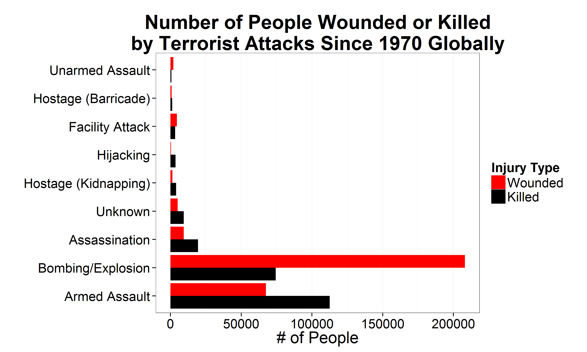
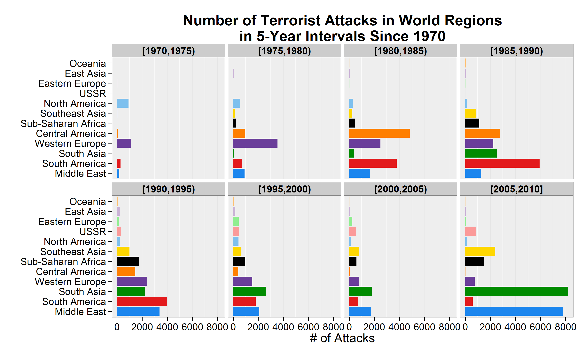

# Global terrorist attacks

Note: This is just a short excerpt from a larger project I wrote last year ([available
here](../../terrorism-project)).  
  
---  
  
The dataset used here is called the Global Terrorism Database
([available here])(http://www.start.umd.edu/gtd/), and contains over 100,000
terrorist incidents worldwide, with over 100 different attributes for each incident. 

Let's start with a very basic, yet upsetting, statistic in the data: the number of people wounded and killed by each attack type overall.

It is immediately visible that bombings and armed assaults are the attacks that
have killed and injured the most people. With bombings, there are far more
people getting injured than killed, while with armed assault the fatalities
are the highest.
  
---  
  
Now let's see how many terrorist attacks occurred at the different world regions,
binned to intervals of 5 years (the code for this binning is not trivial,
you can [look at the source](./script04_calc-attack-per-region-year-bin.R)).

From this set of plots it is much clearer what the terrorist activity situation
was at different regions at different time periods. It's very clear how bad South
Asia and the Middle East are getting recently, and how Central America has
improved drastically since the 1980's.  
We can also see how Oceania and East Asia are the "boring" observations, so if you're looking for a safe place, you know where to go.
