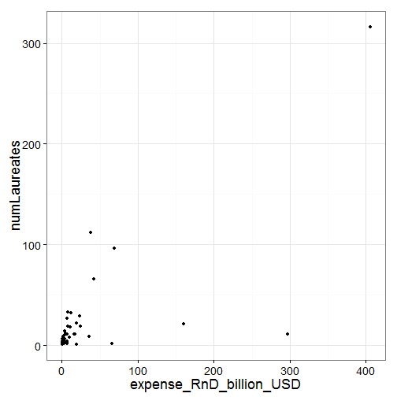
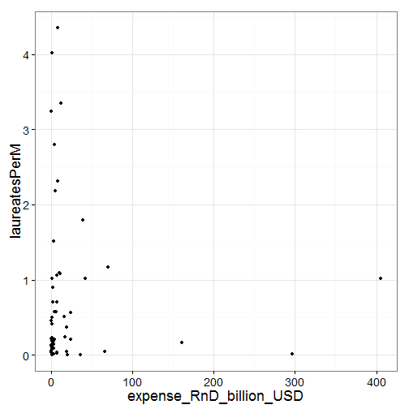
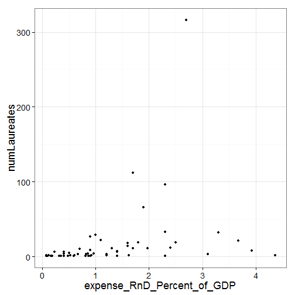
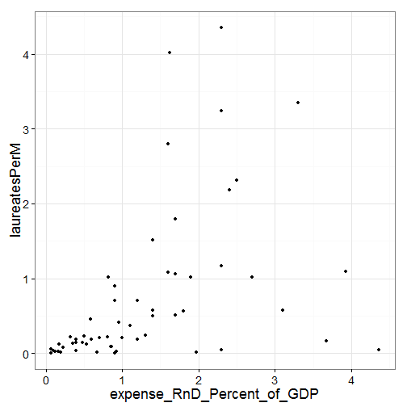

# Homework 12 - Web scraping and APIs
Dean Attali  
Nov 29 2014 

Last updated: 2014-11-30 21:27:45

## Overview
I wanted to see if there's any relationship between the amount of money
a country spends on research and development (R&D) and the number of Nobel
Prize laureates produed by the country.  
I expect that there is such a relationship to some extent. While money spent
on R&D does not necessarily mean the money is going towards science-based R&D
(for example, it can be spent on military research), in general I expect that 
if a lot of  money is spent on research, there would be more people winning a 
Nobel Prize.  To measure this, I will scrape for data on total money spent
on R&D per country from Wikipedia, and combine it with information from
the Nobel Prize API.  
Furthermore, to give smaller countries a chance to shine, I also want to look
at relative metrics. Looking at how much money a country spends and how many
laureates they have is an absolute metric.  I expect that countries that
spend a larger portion of their GDP on research will have more laureates
per capita.  For example, I hypothesize that generally a country that 
spends 5% of their GDP on research rather than 1% will have a larger
portion of the population get Nobel Prizes.  To measure this, I will use the
same data sources as above, but also combine information about the population
of each country to calculate the number of laureates per million citizens.


Note: Some of the code in this script relies on functions available in the
`rsalad` package that I developed, and can be installed with
`devtools::install_github("daattali/rsalad")`. Moreover, this script
is being directly converted to Rmarkdown and HTML using
`rsalad::spinMyR("hw12_web-scraping-api.R", wd = "hw/hw12_web-scraping-api")`
with the working directory being the root directory of this repository.


## Load packages
As always, the first step is to load all the necessary packages


```r
suppressPackageStartupMessages({
	library(plyr)
	library(dplyr)
	library(magrittr)
	library(rvest)
	library(jsonlite)
	library(ggplot2)
  library(Hmisc)
  library(rsalad)  #  devtools::install_github("daattali/rsalad")
})
```

## Retrieve spendings on R&D per country
The first piece of information we'll retrieve is a table telling us how much 
money different countries spend on R&D.  There is a nice Wikipedia page with 
such a table, so we can scrape it very easily using Hadley Wickham's `rvest`
package.    
Note: It literally took me 60 seconds to learn how to parse a table from
Wikipedia using this new package. Hadley is awesome.  
Note 2: I'm not showing the raw table because the formatting is very messed
up because of the rawness of the text in the table. I will show the table
soon after cleaning it up a bit.


```r
wikiRnDPageUrl <- "http://en.wikipedia.org/wiki/List_of_countries_by_research_and_development_spending"
wikiRnDPage <- rvest::html(wikiRnDPageUrl)
wikiRnDTable <-
	wikiRnDPage %>%
	html_node("table") %>%
	html_table
```

Now clean up the data a little bit - remove the columns we don't care about,
rename the ones we do want to keep, and fix the formatting of the numeric
variables (Wikipedia sometimes puts footnote references beside numbers
so we need to clean that up)


```r
countriesRnD <-
	wikiRnDTable %>%
	select(-grep("(Rank)|(Source)|(Expenditure.*per capita)|(Year)",
							 colnames(.),
							 ignore.case = TRUE))
countryIdx <- grep("country", colnames(countriesRnD), ignore.case = TRUE)
totalExpenseIdx <- grep("Expenditure", colnames(countriesRnD), ignore.case = TRUE)
gdpPercentIdx <- grep("%", colnames(countriesRnD), ignore.case = TRUE)
colnames(countriesRnD)[countryIdx] <- "country"
colnames(countriesRnD)[totalExpenseIdx] <- "expense_RnD_billion_USD"
colnames(countriesRnD)[gdpPercentIdx] <- "expense_RnD_Percent_of_GDP"

countriesRnD %<>%
	mutate(expense_RnD_Percent_of_GDP =
				 	as.numeric(sub("%", "", expense_RnD_Percent_of_GDP))) %>%
	mutate(expense_RnD_billion_USD =
				 	as.numeric(sub("([0-9\\.]*).*", "\\1", expense_RnD_billion_USD)))
```

The R&D table is ready. Let's just take a quick look at it. Which countries
spend the most on R&D?


```r
knitr::kable(head(countriesRnD %>% arrange(desc(expense_RnD_billion_USD))))
```


|country       | expense_RnD_billion_USD| expense_RnD_Percent_of_GDP|
|:-------------|-----------------------:|--------------------------:|
|United States |                   405.3|                       2.70|
|China         |                   296.8|                       1.97|
|Japan         |                   160.3|                       3.67|
|Germany       |                    69.5|                       2.30|
|South Korea   |                    65.4|                       4.36|
|France        |                    42.2|                       1.90|

It looks like the US spends way more than anyone else, and China and Japan
are also very big on research spendings. I can believe that.  
Now let's see who spends the most on R&D relative to their GDP


```r
knitr::kable(head(countriesRnD %>% arrange(desc(expense_RnD_Percent_of_GDP))))
```


|country       | expense_RnD_billion_USD| expense_RnD_Percent_of_GDP|
|:-------------|-----------------------:|--------------------------:|
|South Korea   |                    65.4|                       4.36|
|Israel        |                     9.7|                       3.93|
|Japan         |                   160.3|                       3.67|
|Sweden        |                    11.9|                       3.30|
|Finland       |                     6.3|                       3.10|
|United States |                   405.3|                       2.70|

Seems like this category has less extreme outlires. South Korea, Israel,
Japan, Sweden and Finland spend more than 3% of their GDP on R&D.
## Retrieve number of nobel laureates per country 
Next we need to get data about how many nobel laureates each country has.
The official site of the Nobel Prize has a RESTful API
[available here](http://www.nobelprize.org/nobel_organizations/nobelmedia/nobelprize_org/developer/)
that will get us the info we want. Their API is very basic and you can see
some of my complaints about it at the bottom of this report, but it worked.  

The nice thing about this API is that it does not require any registration
or special settings - anyone can access it by simply performing an HTTP GET
request.  

### Mandatory sidetrack: building the API call for Nobel Prize API

In order to use the API, we need to have a good way of building the URLs
to make the API calls. The following two functions are very simple:  
`buildQueryString` simply converts a list of parameters (key=value pairs)
to a query string that can be used in an API call (for example,
`list("a" = "b", "A" = "B")` gets coded as `a=b&A=B`).  
`buildNobelPrizeApi` returns a URL that can be used to query the Nobel Prize
API, given a method and a desired output format. 


```r
buildQueryString <- function(params = list()) {
	queryString <- paste(names(params), as.character(params),
											 sep = "=", collapse = "&")
	queryString
}

nobelApiBase <- "http://api.nobelprize.org"
buildNobelPrizeApi <- function(method, format, params = list(), version = "v1") {
	apiCall <- paste0(nobelApiBase, "/", version, "/", method, ".",
										format, "?", buildQueryString(params))
	apiCall
}
```

### Back to business: get list of coutries supported by Nobel Prize API

In order to be able to query for laureates by country using this API and
merge it with the table we scraped earlier from Wikipedia, we need to make
sure we have a mapping of countries that is consistent between the two
sources.  The Nobel Prize API has a method that simply returns a list of 
countries it supports with the country name and 2-letter country code, so
let's get that list first. The API supports both CSV and JSON return formats,
and I will choose CSV since it's more compact and is more native to R. 


```r
apiCall <- buildNobelPrizeApi("country", "csv")
nobelPrizeCountriesResponse <- RCurl::getURL(apiCall)
nobelPrizeCountries <- read.table(text = nobelPrizeCountriesResponse,
																	header = TRUE, row.names = NULL,
																	sep = ",", quote = "\"")
knitr::kable(head(nobelPrizeCountries))
```


|name                 |code |
|:--------------------|:----|
|Alsace, then Germany |DE   |
|Alsace               |DE   |
|Germany              |DE   |
|Argentina            |AR   |
|Australia            |AU   |
|Austria              |AT   |

### Map coutries from Wikipedia to countries in Nobel Prize

Now that we have a list of countries supported by Nobel Prize API, we will
create a mapping between a country name in the Wikipedia table to the 
country's 2-letter code. For each country in the wikipedia table,
we simply grep for that name in the Nobel Prize API list of countries
and use the first result's 2-letter code.


```r
countryMap <-
	sapply(countriesRnD$country, function(x) {
		nobelPrizeCountries[grep(x, nobelPrizeCountries$name)[1],]$code
	}) %>%
	data.frame() %>%
	set_colnames("countryCode") %>%
	mutate(country = rownames(.)) %>%
	set_rownames(NULL)
knitr::kable(head(countryMap))
```


|countryCode |country       |
|:-----------|:-------------|
|NA          |United States |
|CN          |China         |
|JP          |Japan         |
|DE          |Germany       |
|KR          |South Korea   |
|FR          |France        |

Let's see which countries were not able to be mapped


```r
countryMap[is.na(countryMap$countryCode), "country"]
```

```
##  [1] "United States" "Singapore"     "Malaysia"      "Saudi Arabia" 
##  [5] "Thailand"      "Morocco"       "Kazakhstan"    "Estonia"      
##  [9] "Philippines"   "Uruguay"       "Sudan"         "Uganda"       
## [13] "Botswana"      "Ethiopia"
```

Hmm.. Most of these countries I'm ok with because I can believe they never
got a Nobel Prize, hence they don't exist in the Nobel Prize API. But the US
we definitely have to fix.  The fact that it's showing up here means that
the Nobel Prize API did not have a country named "USA". I'm pretty sure
they do have the US, and that its 2-letter code is "US", so let's try to see
if that's true.


```r
nobelPrizeCountries %>% filter(code == "US")
```

```
##   name code
## 1  USA   US
```

Ah huh, that was the problem - Nobel Prize API calls them "USA" instead of
"United States". No worries, we'll just fix that manually


```r
countryMap[countryMap$country == "United States", "countryCode"] <- "US"
```

There is one more country we need to fix, but I'm only doing this because
I carried out the full analysis and saw a problem at the end. Even though
the Nobel Prize API claims that the United Kingdom is represented by "UK",
I noticed that I was not getting any hits for "UK" when querying their API
(later in the analysis). This seemed strange to me, so I dug into it a little
bit, and discovered that British prize winners are listed under "GB". So
the API lied to me..... We need to use "GB" (Great Britain) instead of "UK".


```r
nobelPrizeCountries %>% filter(name == "United Kingdom")
```

```
##             name code
## 1 United Kingdom   UK
```

```r
countryMap[countryMap$country == "United Kingdom", "countryCode"] <- "GB"
```

Alright, now we have a nice mapping from country name in wikipedia table
to 2-letter code in Nobel Prize data. Let's merge the two, so that the
R&D table will have the country code for each country.


```r
countriesRnD2 <- left_join(countriesRnD, countryMap, by = "country")
countriesRnD2 <- countriesRnD2[complete.cases(countriesRnD2), ]
countriesRnD2 %<>%
	mutate(countryCode = as.character(countryCode))
knitr::kable(head(countriesRnD2))
```


|country       | expense_RnD_billion_USD| expense_RnD_Percent_of_GDP|countryCode |
|:-------------|-----------------------:|--------------------------:|:-----------|
|United States |                   405.3|                       2.70|US          |
|China         |                   296.8|                       1.97|CN          |
|Japan         |                   160.3|                       3.67|JP          |
|Germany       |                    69.5|                       2.30|DE          |
|South Korea   |                    65.4|                       4.36|KR          |
|France        |                    42.2|                       1.90|FR          |

### Get number of nobel laureates from each country using API
Now we have a table with how much each country spends on R&D for countries
that are suppored by the Nobel Prize API.  The next step is to use the API
to see how many nobel prize winners each country has had in history. 
Unfortunately, the API does not provide an easy answer for the question
"Which laureates have nationality X?". Perhaps it's because that question
is a little more complex because a nobel laureate can have multiple
nationalities, in which case I'm not sure which country claims to have
"one of its citizens get the prize". Anyway, the API only provides a function
to query for laureates by country of birth or country of death, so that's 
what we'll have to use. It might not be 100% accurate because just because
someone was born/died in a country doesn't mean they got their prize with
that country, but it's the best proxy for the question I'm asking.

First I will define a function that converts JSON to an R object and reaplces
all `"\r\n"` caracters with a space because they were causing problems in
parsing.


```r
myFromJSON <- function(x) {
	fromJSON(gsub("\r\n"," ", x))
}
```

Now to the real work: for every country in our R&D table, query the Nobel
Prize API for all nobel laureates that were born or died in that country,
and tally how many each country has. In these API calls I'm using JSON
as the return type because I ran into too many problems with csv and also
because this way I can simply extract the number of unique "person id"
to know how many laureates were returned.


```r
laureatesPerCountry <- sapply(countriesRnD2$countryCode, function(x) {
	apiCallBorn <- buildNobelPrizeApi(method = "laureate",
																		format = "json",
																		params = list("bornCountryCode" = x))
	response <- RCurl::getURL(apiCallBorn)
	if (response == "" || length(myFromJSON(response) %>% extract2(1)) == 0) {
		born <- c()
	} else {
		born <- myFromJSON(response) %>% extract2(1) %>% select(id) %>% first
	}
	
	apiCallDied <- buildNobelPrizeApi(method = "laureate",
																			format = "json",
																			params = list("diedCountryCode" = x))
	response <- RCurl::getURL(apiCallDied)
	if (response == "" || length(myFromJSON(response) %>% extract2(1)) == 0) {
		died <- c()
	} else {
		died <- myFromJSON(response) %>% extract2(1) %>% select(id) %>% first
	}
	
	laureatesFromCountry <- unique(c(born, died))
	numLaureates <- length(laureatesFromCountry)
	numLaureates
})
```

The result from `sapply` is a named list, so let's convert it to a nice 
data.frame with proper variable names


```r
laureatesPerCountry %<>%
	data.frame() %>%
	set_colnames("numLaureates") %>%
	mutate(countryCode = rownames(.)) %>%
	set_rownames(NULL)
knitr::kable(head(laureatesPerCountry %>% arrange(desc(numLaureates))))
```


| numLaureates|countryCode |
|------------:|:-----------|
|          316|US          |
|          112|GB          |
|           96|DE          |
|           66|FR          |
|           33|CH          |
|           32|SE          |

Looks good! Looks like the US has way more nobel prize winners than anyone
else. On we go - now let's merge this information (number of laureates per
country) with our table containing research spendings.


```r
countriesLaureatesRnD <- left_join(countriesRnD2, laureatesPerCountry,
																	 by = "countryCode")
knitr::kable(head(countriesLaureatesRnD))
```


|countryCode |country       | expense_RnD_billion_USD| expense_RnD_Percent_of_GDP| numLaureates|
|:-----------|:-------------|-----------------------:|--------------------------:|------------:|
|US          |United States |                   405.3|                       2.70|          316|
|CN          |China         |                   296.8|                       1.97|           11|
|JP          |Japan         |                   160.3|                       3.67|           21|
|DE          |Germany       |                    69.5|                       2.30|           96|
|KR          |South Korea   |                    65.4|                       4.36|            2|
|FR          |France        |                    42.2|                       1.90|           66|

## Retrieve population of countries
The last piece of information I want for the analysis is the population
size of each country.  There are obviously many sources for such information.
I could have used Jenny Bryan's `Gapminder` package, for example, but a
better source I found was from [GeoNames](http://www.geonames.org/countries/)
since they have the 2-letter code for each country, so it'll be easier to 
merge with our data.

Once again, I will use Hadley Wickham's `rvest` package, this time to scrape
a table of country populations from GeoNames. I'm still excited by how
easy this is!


```r
countryPopUrl <- "http://www.geonames.org/countries/"
countryPopulationPage <- rvest::html(countryPopUrl)
countryPop <-
  countryPopulationPage %>%
  html_nodes("table") %>%
  extract2(2) %>%
	html_table
knitr::kable(head(countryPop))
```


|ISO-3166alpha2 |ISO-3166alpha3 | ISO-3166numeric|fips |Country              |Capital          |Area in km² |Population |Continent |
|:--------------|:--------------|---------------:|:----|:--------------------|:----------------|:-----------|:----------|:---------|
|AD             |AND            |              20|AN   |Andorra              |Andorra la Vella |468.0       |84,000     |EU        |
|AE             |ARE            |             784|AE   |United Arab Emirates |Abu Dhabi        |82,880.0    |4,975,593  |AS        |
|AF             |AFG            |               4|AF   |Afghanistan          |Kabul            |647,500.0   |29,121,286 |AS        |
|AG             |ATG            |              28|AC   |Antigua and Barbuda  |St. John's       |443.0       |86,754     |NA        |
|AI             |AIA            |             660|AV   |Anguilla             |The Valley       |102.0       |13,254     |NA        |
|AL             |ALB            |               8|AL   |Albania              |Tirana           |28,748.0    |2,986,952  |EU        |

Cool. Let's just clean that up a bit - only retain the few variables we need,
change their names, and strip the formatting from the population variable.


```r
countryPop %<>% 
	set_colnames(sub("ISO-3166alpha2", "countryCode", colnames(.)) %>%
                 tolowerfirst) %>%
	mutate(population = as.numeric((gsub(",", "", population)))) %>%
  select(countryCode, population)
knitr::kable(head(countryPop))
```


|countryCode | population|
|:-----------|----------:|
|AD          |      84000|
|AE          |    4975593|
|AF          |   29121286|
|AG          |      86754|
|AI          |      13254|
|AL          |    2986952|

Looks good. Now the final step of data preparation - merge this information
into our data. Let's make sure that we don't have any missing values in any 
of the observations.


```r
dataFinal <- left_join(countriesLaureatesRnD, countryPop,
                                   by = "countryCode")
sum(!complete.cases(dataFinal))
```

```
## [1] 0
```

Awesome. Now, remeber that the main reason I wanted to know the population of 
each country is so that we can see how many laureates a country has relative 
to their size, so let's add a variable for number of laureates per million 
people.  And this is how our final data looks like:


```r
dataFinal %<>%
	mutate(laureatesPerM = numLaureates / population * 1000000) %>%
	arrange(desc(numLaureates))
knitr::kable(head(dataFinal))
```


|countryCode |country        | expense_RnD_billion_USD| expense_RnD_Percent_of_GDP| numLaureates| population| laureatesPerM|
|:-----------|:--------------|-----------------------:|--------------------------:|------------:|----------:|-------------:|
|US          |United States  |                   405.3|                        2.7|          316|  310232863|      1.018590|
|GB          |United Kingdom |                    38.4|                        1.7|          112|   62348447|      1.796356|
|DE          |Germany        |                    69.5|                        2.3|           96|   81802257|      1.173562|
|FR          |France         |                    42.2|                        1.9|           66|   64768389|      1.019016|
|CH          |Switzerland    |                     7.5|                        2.3|           33|    7581000|      4.352988|
|SE          |Sweden         |                    11.9|                        3.3|           32|    9555893|      3.348719|

## Data is ready - analysis time!

Now that we have the data ready, it's time for the fun stuff, can we 
spot any correlations between the variables in our data?

  
### Easily test the correlation of two variables
  
I want to test out different combinations of variables, so I'll create a
function that will accept two variables from the data and perform a basic
analysis. It will plot the two variables against each other and calculate
the Pearson correlation between them and the significance of the correlation.
(note that I'll be performing 4 tests, so I'm using a simple Bonferroni
correction)


```r
NUM_TESTS <- 4
analyzeVars <- function(...) {
  # Parse the x and y variabels
  vars <- as.character(substitute(list(...)))[-1L]
  x <- vars[1]
  y <- vars[2]
  
  # Generate scatterplot of x and y
  p <- ggplot(dataFinal, aes_string(x, y)) + geom_point() + theme_bw(18)
  print(p)
  
  # Calculate correlation
  corResult <-
    dataFinal %>%
    {rcorr(extract2(., x),
          extract2(., y))}
  
  cor <- corResult[['r']][2]
  pval <- p.adjust(corResult[['P']][2], method = "bonferroni", n = NUM_TESTS)
  
  cat(paste0("Looking at `", x, "` and `", y, "`:\n",
             "Correlation: ", round(cor, 3), "\n",
             "p-value (corrected) for the correlation: ", round(pval, 3)))
}
```

### USD spent on R&D vs number of Nobel laureates

Let's see if there is any relationship between a country's spending on R&D
and the number of Nobel laureated the country produces. 


```r
analyzeVars(expense_RnD_billion_USD, numLaureates)
```

 

```
## Looking at `expense_RnD_billion_USD` and `numLaureates`:
## Correlation: 0.739
## p-value (corrected) for the correlation: 0
```

From the plot it looks like there is some relationship between total spending
and number of laureates.  The statistical analysis does indeed show a fairly
strong correlation that is very statistically significant. So it looks like
my original hypothesis was correct (yeah, yeah, in science we can't say
we "proved" this hypothesis - but I'm just talking in plain English here).

### USD spent on R&D vs laureates per million people

So we saw that there is some correlation between a country's total spending
and the number of laureates, but what if we look at number of laureates 
relative to the country size? The reason I calculated laureates per million
people is because I hypothesized that the total spendings do not affect
this metric. Let's see.


```r
analyzeVars(expense_RnD_billion_USD, laureatesPerM)
```

 

```
## Looking at `expense_RnD_billion_USD` and `laureatesPerM`:
## Correlation: -0.037
## p-value (corrected) for the correlation: 1
```

The plot does not show any clear sign of a relationship, and the statistical
analysis shows that the correlation is almost 0 and statistically
insignificant.  Again, this goes with what I expected.

### Percent of GDP spent on R&D vs number of Nobel laureates

I expect that there will be no significant relationship here. A country
that spends a large portion of its GDP on research does not necessarily
produce many Nobel laureates if the country is small for example. 


```r
analyzeVars(expense_RnD_Percent_of_GDP, numLaureates)
```

 

```
## Looking at `expense_RnD_Percent_of_GDP` and `numLaureates`:
## Correlation: 0.301
## p-value (corrected) for the correlation: 0.083
```

From the plot we don't see a strong relationship between the two variables,
and the p value is indeed not very significant, so nothing interesting here.

### Percent of GDP spent on R&D vs laureates per million people
Here I do expect to see a correlation - a country that spends a large
portion of its GDP on research places more emphasis on research, so 
this should equate to a larger proportion of their population winning
scientific awards.  Both variables here are relative rathen than absolute,
that's why I expect to see a relationship.


```r
analyzeVars(expense_RnD_Percent_of_GDP, laureatesPerM)
```

 

```
## Looking at `expense_RnD_Percent_of_GDP` and `laureatesPerM`:
## Correlation: 0.455
## p-value (corrected) for the correlation: 0.001
```

The plot clearly shows some correlation, and the statistical analysis
agrees - a correlation of 0.455 which is very significant (p value ~0.001).
This is again what I expected to see.

## Conclusion

As expected, we saw that countries that spend more absolute money on research
generally have more Nobel laureates, and countries that spend a larger
fraction of their GDP on research (a relative measure) have more laureates
per million people.
## Rant about the Nobel Prize API

Any API will always have some problems and any developer will find things to
complain about :) Here are the main big things that bugged me about using
this API:  

- When getting the list of laureates for each country, I First tried using
csv, but certain countries were giving me problems and it was unreasonably
difficult to understand where the problem was. I then tried json in hopes
that I will be able to get it working faster, which also gave problems. Both
of them worked for most countries, but not for all of them. With JSON,
sometimes an empty list (meaning a country who never had any nobel laureates)
was returned as `""` and sometimes as `{"laureates":[]}`, which seems like
a bad inconsistency from the API developers.  
- Another problem with JSON was that a few countries had `"\r\n"` in the
text, which was causing errors in the JSON parsing. I ended up just writing
a wrapper around `fromJSON` to remove those characters.  
- Mapping countries across sources was a big pain. Especially the fact that 
the nobel laureates API specifically returned a mapping from
"United Kingdom" -> "UK", yey a search for "UK" returned 0 laureates while a
search for GB returned many. Not cool, Nobel Prize API.  
- I was a little disappointed that there was no way to perform an "OR"
query, though that's not too surprising, it's not a feature that's commonly
supported (I wanted to query for laureates "born OR died IN country X").  
- One thing that surprised me is that the Nobel Prize API does not return
a laureate's nationality, nor do they have a way to query by nationality.
This is why I ended up searching by birth/death country, which is the closest
thing I could think if. In their defence, maybe adding nationality is a
debated issue because a laureate can have multiple nationalities?
- Using Hadley Wickham's `rvest` package was amazing.

<br/><br/>

-------------
 
#### Session info:


```r
sessionInfo()
```

```
## R version 3.1.2 (2014-10-31)
## Platform: x86_64-w64-mingw32/x64 (64-bit)
## 
## locale:
## [1] LC_COLLATE=English_United States.1252 
## [2] LC_CTYPE=English_United States.1252   
## [3] LC_MONETARY=English_United States.1252
## [4] LC_NUMERIC=C                          
## [5] LC_TIME=English_United States.1252    
## 
## attached base packages:
## [1] splines   grid      stats     graphics  grDevices utils     datasets 
## [8] methods   base     
## 
## other attached packages:
##  [1] rsalad_0.0.1.2   Hmisc_3.14-6     Formula_1.1-2    survival_2.37-7 
##  [5] lattice_0.20-29  ggplot2_1.0.0    jsonlite_0.9.13  rvest_0.1.0.9000
##  [9] magrittr_1.5     dplyr_0.3.0.2    plyr_1.8.1      
## 
## loaded via a namespace (and not attached):
##  [1] acepack_1.3-3.3     assertthat_0.1      cluster_1.15.3     
##  [4] codetools_0.2-9     colorspace_1.2-4    DBI_0.3.1          
##  [7] digest_0.6.4        evaluate_0.5.5      foreign_0.8-61     
## [10] formatR_1.0         gtable_0.1.2        highr_0.4          
## [13] httr_0.5            knitr_1.8           labeling_0.3       
## [16] latticeExtra_0.6-26 lazyeval_0.1.9      markdown_0.7.4     
## [19] MASS_7.3-35         mime_0.2            munsell_0.4.2      
## [22] nnet_7.3-8          parallel_3.1.2      proto_0.3-10       
## [25] RColorBrewer_1.0-5  Rcpp_0.11.3         RCurl_1.95-4.3     
## [28] reshape2_1.4        rpart_4.1-8         scales_0.2.4       
## [31] selectr_0.2-2       stringr_0.6.2       tools_3.1.2        
## [34] XML_3.98-1.1
```

