Lattice
================

```r
gDat <- read.delim("gapminderDataFiveYear.txt")
hDat <- subset(gDat, year %in% c(1952, 2007))

library(lattice)
library(plyr)

###################### 1 DIMENSIONAL

# multiple plots on same page
strplt1 <- stripplot(lifeExp ~ continent, hDat)
hstgrm1 <- histogram(~pop, gDat, subset = (continent == "Europe" & year == 2007))
plot(strplt1, split = c(1, 1, 1, 2))
plot(hstgrm1, split = c(1, 2, 1, 2), newpage = FALSE)
```

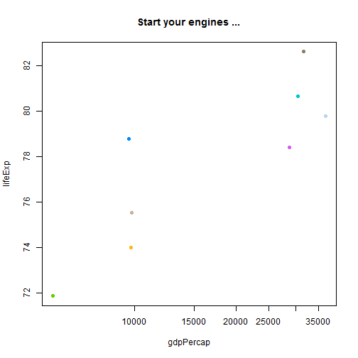 

```r

# some strip plots. Avoid overplotting in 1D with jitter/densityplot
stripplot(lifeExp ~ continent, hDat)
```

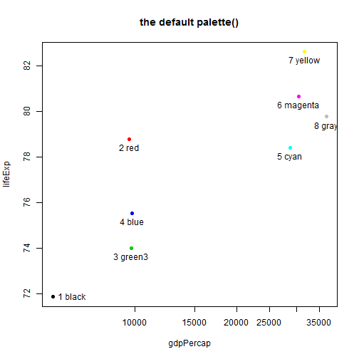 

```r
stripplot(lifeExp ~ continent, hDat, jitter.data = TRUE, grid = "h", type = c("p", 
    "a"), group = year)
```

 

```r
stripplot(lifeExp ~ continent, hDat, jitter.data = TRUE, grid = "h", type = c("p", 
    "a"), group = year, fun = min, auto.key = list(reverse.rows = TRUE))
```

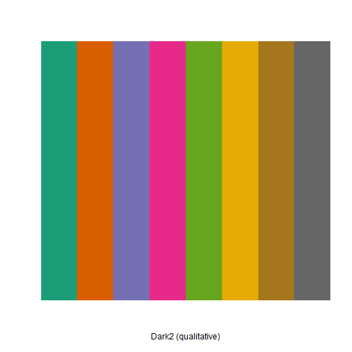 

```r

# get rid of useless oceania
iDat <- subset(hDat, continent != "Oceania")
iDat <- droplevels(iDat)
jDat <- droplevels(subset(gDat, continent != "Oceania"))

# reorder the continents based on life expectancy
iDat <- within(iDat, continent <- reorder(continent, lifeExp))
ddply(iDat, ~continent, summarize, avgLifeExp = mean(lifeExp))
```

```
##   continent avgLifeExp
## 1    Africa      46.97
## 2      Asia      58.52
## 3  Americas      63.44
## 4    Europe      71.03
```

```r

# density plot (~smooth histogram)
densityplot(~lifeExp, iDat)
```

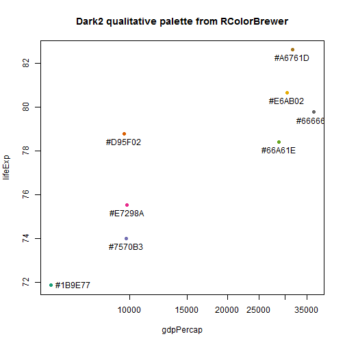 

```r
densityplot(~lifeExp, iDat, plot.points = FALSE, ref = TRUE, group = continent, 
    auto.key = list(columns = nlevels(iDat$continent)))
```

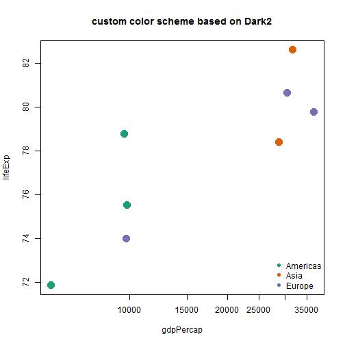 

```r
densityplot(~lifeExp | factor(year), iDat)
```

 

```r
hardCorners <- densityplot(~lifeExp, iDat, n = 20, main = "n = 20")
softCorners <- densityplot(~lifeExp, iDat, n = 200, main = "n = 200")
# make the plot smoother wish more line segments (n=)
print(hardCorners, position = c(0, 0, 0.55, 1), more = TRUE)
print(softCorners, position = c(0.45, 0, 1, 1))
```

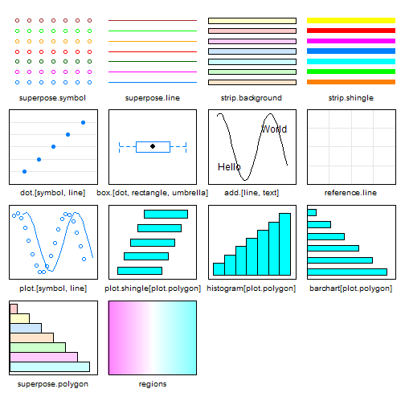 

```r
# adjust the bandwidth to make the plot less/more sensitive
wiggly <- densityplot(~lifeExp, iDat, adjust = 0.5, main = "default bw * 0.5")
rolling <- densityplot(~lifeExp, iDat, adjust = 2, main = "default bw * 2")
print(wiggly, position = c(0, 0, 0.55, 1), more = TRUE)
print(rolling, position = c(0.45, 0, 1, 1))
```

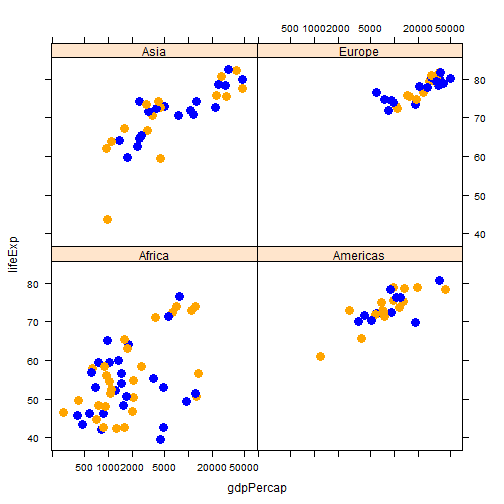 

```r

# histogram
histogram(~lifeExp, gDat)
```

 

```r
histogram(~lifeExp, gDat, nint = 50)
```

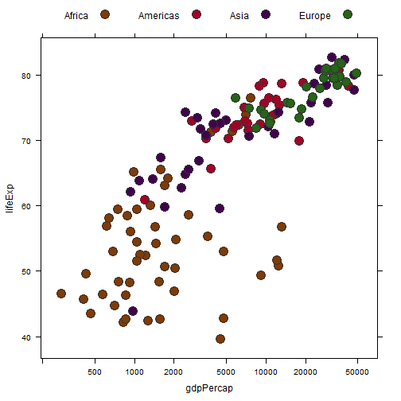 

```r

# box plot/violin plot
bwplot(lifeExp ~ continent, iDat)
```

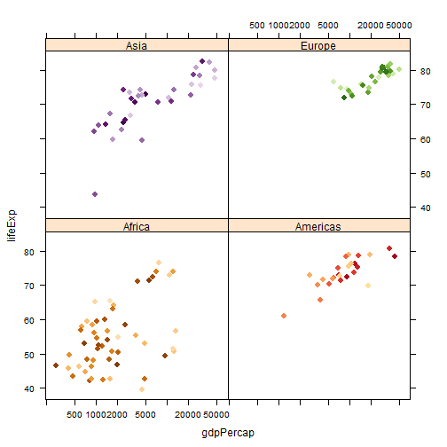 

```r
bwplot(lifeExp ~ continent, iDat, panel = panel.violin)
```

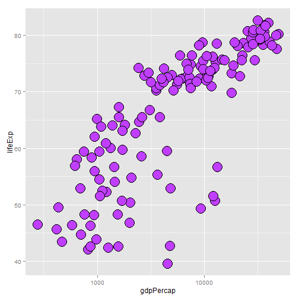 

```r
bwplot(lifeExp ~ as.factor(year) | continent, subset(gDat, continent != "Oceania"))
```

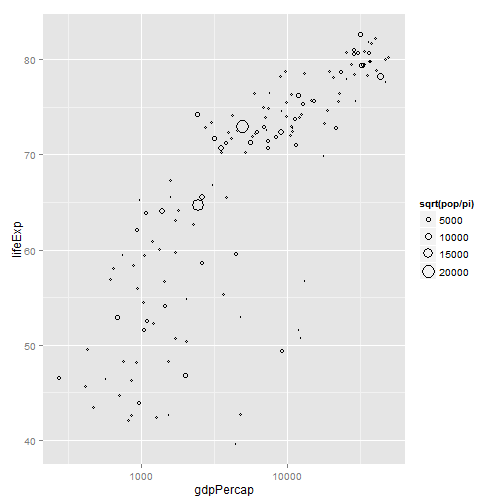 

```r

# using panel function to have multiple plots on same panel
bwplot(lifeExp ~ reorder(continent, lifeExp), subset(gDat, continent != "Oceania"), 
    panel = function(..., box.ratio) {
        panel.violin(..., col = "transparent", border = "grey60", varwidth = FALSE, 
            box.ratio = box.ratio)
        panel.bwplot(..., fill = NULL, box.ratio = 0.1)
    })
```

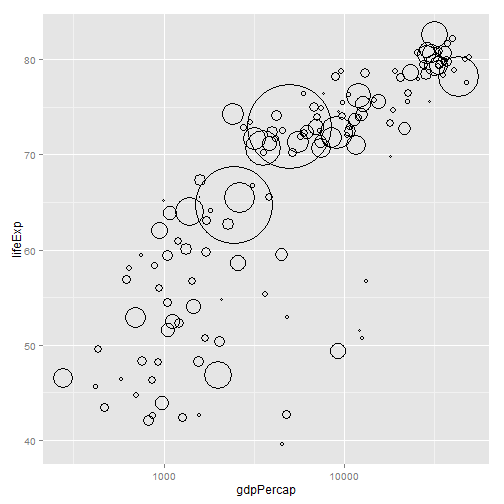 

```r

# cool titanic survival example showing some advanced features
bc.titanic <- barchart(Class ~ Freq | Sex + Age, as.data.frame(Titanic), groups = Survived, 
    stack = TRUE, layout = c(4, 1), auto.key = list(title = "Survived", columns = 2), 
    scales = list(x = "free"))
plot(bc.titanic)
```

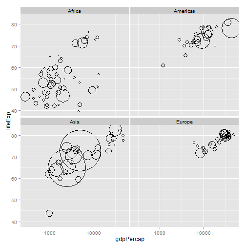 

```r

########################### 2 DIMENSIONAL

# too much data clustered, we need to log this!
xyplot(lifeExp ~ gdpPercap, iDat, grid = TRUE)
```

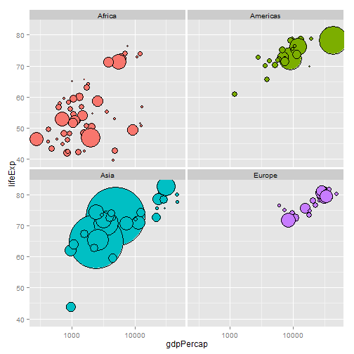 

```r
xyplot(lifeExp ~ gdpPercap, iDat, grid = TRUE, scales = list(x = list(log = 10, 
    equispaced.log = FALSE)), type = c("p", "smooth"), lwd = 2, group = continent, 
    auto.key = list(columns = nlevels(iDat$continent)))
```

 

```r

# avoiding overplotting in 2D with smoothscatter/hexagonal bins
xyplot(lifeExp ~ gdpPercap | continent, iDat, grid = TRUE, scales = list(x = list(log = 10, 
    equispaced.log = FALSE)), panel = panel.smoothScatter)
```

```
## KernSmooth 2.23 loaded Copyright M. P. Wand 1997-2009 (loaded the
## KernSmooth namespace)
```

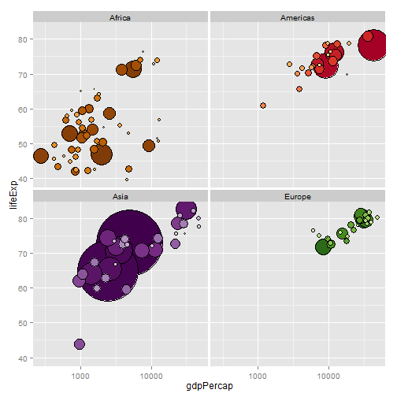 

```r

library(hexbin)
```

```
## Warning: package 'hexbin' was built under R version 3.0.2
```

```
## Loading required package: grid
```

```r
hexbinplot(lifeExp ~ gdpPercap, iDat, scales = list(x = list(log = 10, equispaced.log = FALSE)), 
    aspect = 1, xbins = 30)
```

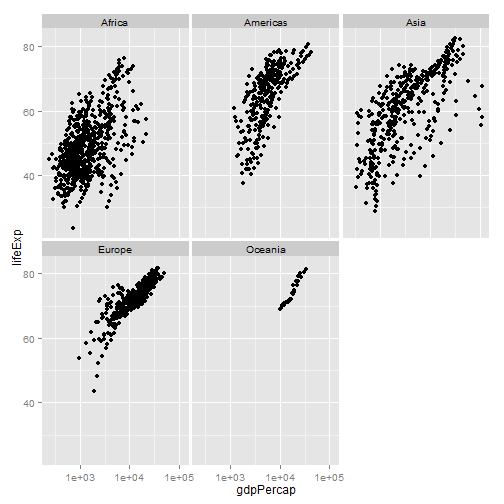 

```r

xyplot(sdGdpPercap + iqrGdpPercap + madGdpPercap ~ year, lifeExpSpread, subset = continent == 
    "Africa", type = "b", ylab = "measure of spread", auto.key = list(x = 0.07, 
    y = 0.85, corner = c(0, 1)))
```

```
## Error: object 'lifeExpSpread' not found
```

```r


lifeExpSpread <- ddply(jDat, ~continent + year, summarize, sdGdpPercap = sd(gdpPercap), 
    iqrGdpPercap = IQR(gdpPercap), madGdpPercap = mad(gdpPercap))
xyplot(sdGdpPercap + iqrGdpPercap + madGdpPercap ~ year, lifeExpSpread, group = reorder(continent, 
    sdGdpPercap), layout = c(3, 1), type = "b", ylab = "measure of spread", 
    auto.key = list(x = 0.35, y = 0.85, corner = c(0, 1), reverse.rows = TRUE))
```

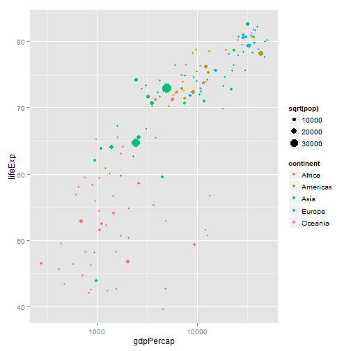 

```r
xyplot(sdGdpPercap + iqrGdpPercap + madGdpPercap ~ year, lifeExpSpread, subset = continent == 
    "Africa", type = "b", ylab = "measure of spread", outer = TRUE, layout = c(3, 
    1), aspect = 1)
```

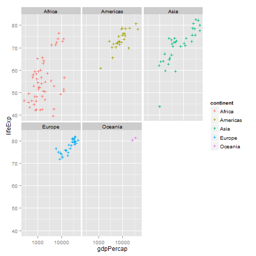 

