# Analysis of Global Terrorism Activity
Dean Attali  
October 2013  

_Dean Attali  
October 2013  
UBC STAT545A Final Project_

**Note:** All the data and code required to create this report are available on [GitHub](https://github.com/daattali/statsTerrorismProject).

Summary
---------

In this project, I explored a dataset containing information about global terrorism acts since 1970, and attempted to make the findings as visual as possible.  The dataset used is called the Global Terrorism Database ([available here](http://www.start.umd.edu/gtd/)), and contains over 100,000 terrorist incidents worldwide, with over 100 different attributes for each incident.  Most of the analysis is done globally, but one of the scripts focuses on terrorism in Israel since it is very relevant to me.  Another dataset that is used to retrieve some additional information about countries is the GapMinder data ([available here](http://www.gapminder.org/)).

While there are dozens of interesting ideas to explore within the dataset, I had to choose only a small subset of them to implement. There is much more that can be done with this database. In order to simplify and make the analysis much more efficient, I chose to discard over 100 attributes, and only retain a few of the key variables such as date, attack type, location, and casualties.  It should also be noted that all information from 1993 is missing from this database as a result of human error (more information is available [here](http://www.start.umd.edu/gtd/faq/#q9)).

This report focuses on displaying and anlyzing the results, but de-emphasizes the underlying process and code. Numerous hours were spent on getting this done, including several all-night coding sessions that ended after the birds got up. To get a better understanding of how the data was manipulated and how all the scripts work, feel free to look at the [Git repository for this project](https://github.com/daattali/statsTerrorismProject).  You can also download the raw data and code to run the analysis from there.

### Global Terrorism

Let's start with a very basic, yet upsetting, statistic in the data: the number of people wounded and killed by each attack type overall.

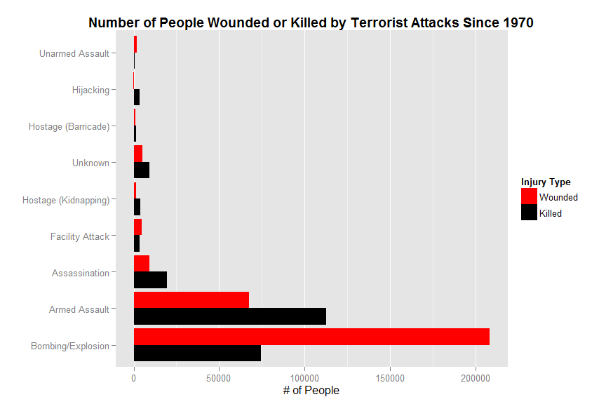

It is immediately visible that bombings and armed assaults are the attacks that have killed and injured the most people.  With bombings, there are far more people getting injured than killed, while with armed assault the fatalities are the highest.

---

Now let's look at some region-level statistics.  
Let's get a quick overview of the regions, and see how many attacks happened in each.

It looks like overall since 1970, there hasn't been one major region that suffered more than all others. Every successvie region has less terror attacks than its previous, but the gap is never massive.

---

Next we will zoom in and see what happens when we look at different years rather than combined history.

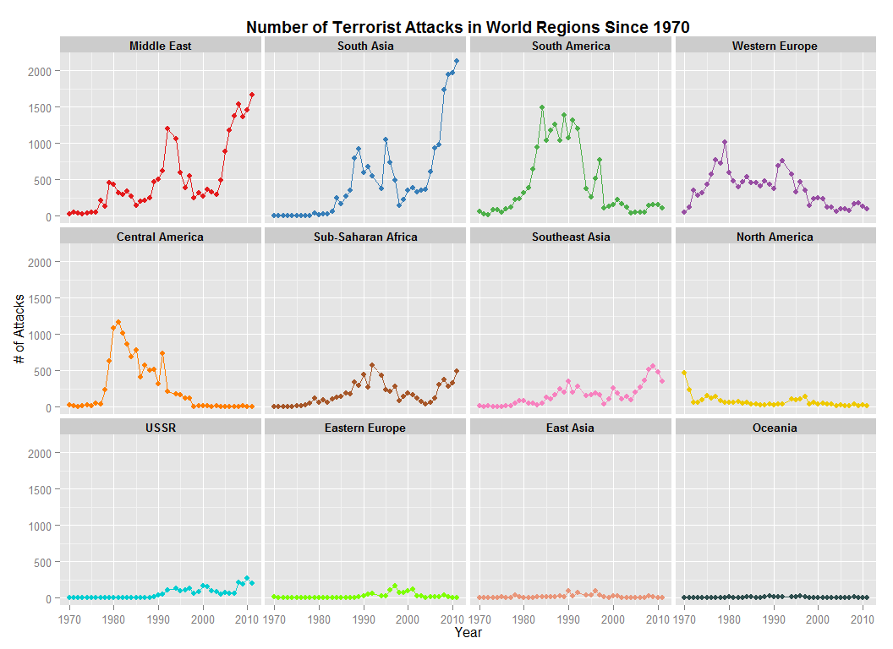

This already reveals some interesting patterns.  
Central America seemed to be very unstable starting at the late 1970's and slowly got better with time, until almost eliminating terrorist attacks before the new millenium.  
The Middle East and South Asia both had a surge of terrorist attacks since circa 2005, after both having "relative" quiet since the mid 90's.  
South America was consistently pretty dangerous througout the 80's and 90's, and has calmed since.  
Western Europe is another region worth mentioning, that had many attacks up until the new millenium.  
The rest of the regions are worth glancing at, but are not as interesting.

---

Now let's look at the same plot, but with all the regions superposed.

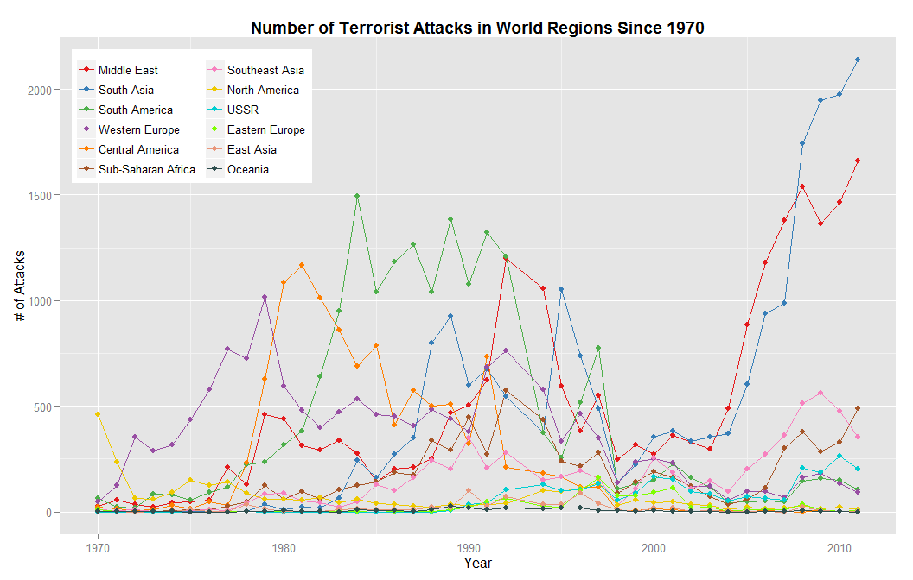

While this looks messy and a little harder to read, it is interesting to see global patterns.  
We can see that from the late 70's til the late 90's, many regions experienced higher terror attacks, and by 2000 most have achieved relative peace. Interestingly, the Middle East and South Asia (both of which also seemed to have much lower terrorist activity around the turn of the millenium) have both seen a sharp increase in the past decade.

---

Another way to visualize this data would be to group the years into 5-year buckets, and see the different regions at each time frame.

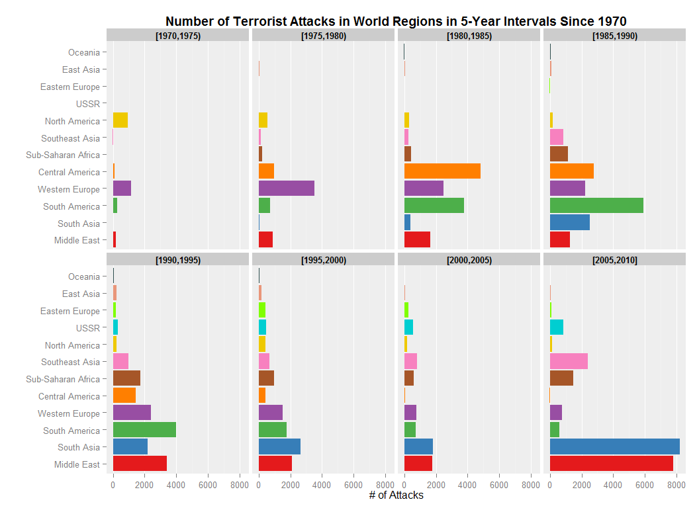

From this set of plots it is much clearer what the terrorist activity situation was at different regions at different time periods. Similar patterns emerge (which makes sense because we are looking at the same data), but it's even more clear now how bad South Asia and the Middle East are getting recently, and how Central America has improved drastically since the 1980's.  
We can also see how Oceania and East Asia are the "boring" observations once again, so if you're looking for a safe place, you know where to go.

---

One interesting question that could be asked is whether there is much variation within the different regions, ie. are a few countries the cause of most terrorism in a region. Let's see!

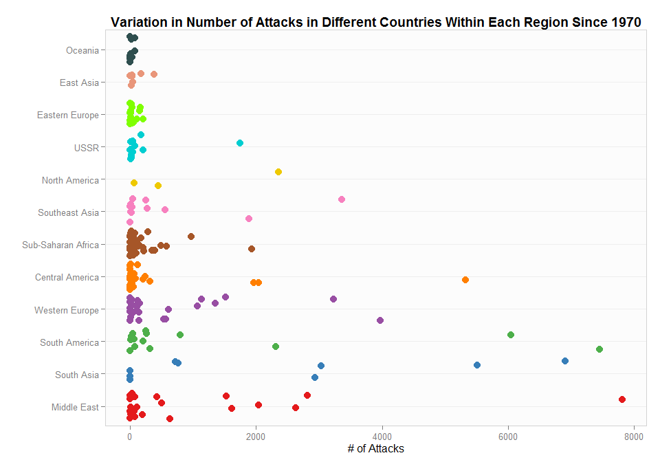

Each point represents the number of terrorist attacks in a country, divided into regions. This does indeed show that usually there are just a few countries where most of the terrorism happens, whereas most other countries in the region are safer.

---

It would be interesting to see which countries are the ones that are hit the hardest.  By visual inspection, we can see that there are never more than 5 countries in a region that are extremely worse than the rest, so let's pick out the highest 5 per region. We'll also drop the 3 boring continents to make the resulting table a little bit easier to digest.

<!-- html table generated in R 3.1.0 by xtable 1.7-3 package -->
<!-- Fri Oct 24 16:22:27 2014 -->
<TABLE border=1>
<TR> <TH> Region </TH> <TH> Country </TH> <TH> # Attacks </TH>  </TR>
  <TR> <TD> Middle East </TD> <TD> Iraq </TD> <TD align="right"> 7807 </TD> </TR>
  <TR> <TD> Middle East </TD> <TD> Turkey </TD> <TD align="right"> 2820 </TD> </TR>
  <TR> <TD> Middle East </TD> <TD> Algeria </TD> <TD align="right"> 2630 </TD> </TR>
  <TR> <TD> Middle East </TD> <TD> Lebanon </TD> <TD align="right"> 2036 </TD> </TR>
  <TR> <TD> Middle East </TD> <TD> Israel </TD> <TD align="right"> 1618 </TD> </TR>
  <TR> <TD> South Asia </TD> <TD> India </TD> <TD align="right"> 6905 </TD> </TR>
  <TR> <TD> South Asia </TD> <TD> Pakistan </TD> <TD align="right"> 5510 </TD> </TR>
  <TR> <TD> South Asia </TD> <TD> Afghanistan </TD> <TD align="right"> 3039 </TD> </TR>
  <TR> <TD> South Asia </TD> <TD> Sri Lanka </TD> <TD align="right"> 2935 </TD> </TR>
  <TR> <TD> South Asia </TD> <TD> Bangladesh </TD> <TD align="right"> 764 </TD> </TR>
  <TR> <TD> South America </TD> <TD> Colombia </TD> <TD align="right"> 7453 </TD> </TR>
  <TR> <TD> South America </TD> <TD> Peru </TD> <TD align="right"> 6046 </TD> </TR>
  <TR> <TD> South America </TD> <TD> Chile </TD> <TD align="right"> 2313 </TD> </TR>
  <TR> <TD> South America </TD> <TD> Argentina </TD> <TD align="right"> 799 </TD> </TR>
  <TR> <TD> South America </TD> <TD> Bolivia </TD> <TD align="right"> 313 </TD> </TR>
  <TR> <TD> Western Europe </TD> <TD> Northern Ireland </TD> <TD align="right"> 3974 </TD> </TR>
  <TR> <TD> Western Europe </TD> <TD> Spain </TD> <TD align="right"> 3233 </TD> </TR>
  <TR> <TD> Western Europe </TD> <TD> Italy </TD> <TD align="right"> 1515 </TD> </TR>
  <TR> <TD> Western Europe </TD> <TD> Corsica </TD> <TD align="right"> 1351 </TD> </TR>
  <TR> <TD> Western Europe </TD> <TD> France </TD> <TD align="right"> 1140 </TD> </TR>
  <TR> <TD> Central America </TD> <TD> El Salvador </TD> <TD align="right"> 5320 </TD> </TR>
  <TR> <TD> Central America </TD> <TD> Guatemala </TD> <TD align="right"> 2043 </TD> </TR>
  <TR> <TD> Central America </TD> <TD> Nicaragua </TD> <TD align="right"> 1968 </TD> </TR>
  <TR> <TD> Central America </TD> <TD> Honduras </TD> <TD align="right"> 318 </TD> </TR>
  <TR> <TD> Central America </TD> <TD> Puerto Rico </TD> <TD align="right"> 246 </TD> </TR>
  <TR> <TD> Sub-Saharan Africa </TD> <TD> South Africa </TD> <TD align="right"> 1933 </TD> </TR>
  <TR> <TD> Sub-Saharan Africa </TD> <TD> Somalia </TD> <TD align="right"> 969 </TD> </TR>
  <TR> <TD> Sub-Saharan Africa </TD> <TD> Nigeria </TD> <TD align="right"> 577 </TD> </TR>
  <TR> <TD> Sub-Saharan Africa </TD> <TD> Angola </TD> <TD align="right"> 492 </TD> </TR>
  <TR> <TD> Sub-Saharan Africa </TD> <TD> Burundi </TD> <TD align="right"> 397 </TD> </TR>
  <TR> <TD> Southeast Asia </TD> <TD> Philippines </TD> <TD align="right"> 3363 </TD> </TR>
  <TR> <TD> Southeast Asia </TD> <TD> Thailand </TD> <TD align="right"> 1888 </TD> </TR>
  <TR> <TD> Southeast Asia </TD> <TD> Indonesia </TD> <TD align="right"> 558 </TD> </TR>
  <TR> <TD> Southeast Asia </TD> <TD> Myanmar </TD> <TD align="right"> 270 </TD> </TR>
  <TR> <TD> Southeast Asia </TD> <TD> Cambodia </TD> <TD align="right"> 256 </TD> </TR>
  <TR> <TD> North America </TD> <TD> United States </TD> <TD align="right"> 2362 </TD> </TR>
  <TR> <TD> North America </TD> <TD> Mexico </TD> <TD align="right"> 451 </TD> </TR>
  <TR> <TD> North America </TD> <TD> Canada </TD> <TD align="right"> 64 </TD> </TR>
  <TR> <TD> USSR </TD> <TD> Russia </TD> <TD align="right"> 1744 </TD> </TR>
  <TR> <TD> USSR </TD> <TD> Georgia </TD> <TD align="right"> 204 </TD> </TR>
  <TR> <TD> USSR </TD> <TD> Tajikistan </TD> <TD align="right"> 175 </TD> </TR>
  <TR> <TD> USSR </TD> <TD> Soviet Union </TD> <TD align="right"> 76 </TD> </TR>
  <TR> <TD> USSR </TD> <TD> Azerbaijan </TD> <TD align="right"> 42 </TD> </TR>
   </TABLE>

Ouch. Looks like Iraq is the unlucky country that attracted the most terrorism acts in the world.  
The rest of the Middle East isn't doing amazingly well, but no one is close to Iraq in that geographic area.  
In South Asia, India and Pakistan, and to a lesser extend Afghanistan and Sri Lanka, are the ones responsible for most of the terrorism.  
Colombia is the terrorist hotbed of South America, while Peru also got a lot of suffering.  
In Western Europe, it is North Ireland and Spain that sustained most of the damage, while in Central America it is El Salvador.  
In Sub-Saharan Africa, South Africa is the country that has the most terrorism activities.  
The Philippines and Thailand are the two countries most prone to terror attacks in Southeast Asia, while in North America it is the United States.  
Lastly, out of all the Soviet Union countries, Russia seems to be the one that suffered the most from terrorism.

---

Another possibly interesting piece of information to look at is what kinds of terror attacks are most common at each region.

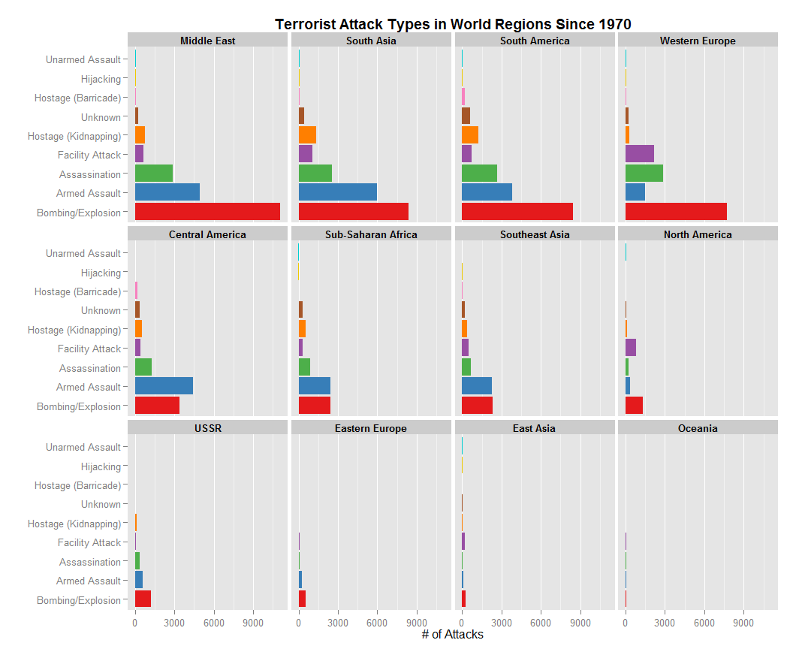

These plots reveal a few interesting bits of information.  
Firstly, we can see that almost everywhere in the world bombings are the most common, followed by armed assaults and assassinations. Facility attacks and hostake kidnappings are the next most common attacks, while the rest are very minimal. It is interesting to note that Central America is the only place where armed assault is more common than bombings, and that in Africa and Southeast Asia there are as many armed assaults as bombings.  
Another observation that stands out is the facility attacks in North America. where it is almost the most common form of terrorism, slightly less than bombings.

### A couple maps!

First thing I would like to see is which cities in the world are the most dangerous (this turns out to be pretty complicated to extract, [go read the code!](https://github.com/daattali/statsTerrorismProject)).

<!-- html table generated in R 3.1.0 by xtable 1.7-3 package -->
<!-- Fri Oct 24 16:22:29 2014 -->
<TABLE border=1>
<TR> <TH> Country </TH> <TH> City </TH> <TH> # Attacks </TH>  </TR>
  <TR> <TD> Iraq </TD> <TD> Baghdad </TD> <TD align="right"> 3358 </TD> </TR>
  <TR> <TD> Peru </TD> <TD> Lima </TD> <TD align="right"> 2226 </TD> </TR>
  <TR> <TD> Northern Ireland </TD> <TD> Belfast </TD> <TD align="right"> 1925 </TD> </TR>
  <TR> <TD> El Salvador </TD> <TD> San Salvador </TD> <TD align="right"> 1547 </TD> </TR>
  <TR> <TD> Chile </TD> <TD> Santiago </TD> <TD align="right"> 1494 </TD> </TR>
  <TR> <TD> Pakistan </TD> <TD> Karachi </TD> <TD align="right"> 1478 </TD> </TR>
  <TR> <TD> Colombia </TD> <TD> Bogota </TD> <TD align="right"> 908 </TD> </TR>
  <TR> <TD> Turkey </TD> <TD> Istanbul </TD> <TD align="right"> 905 </TD> </TR>
  <TR> <TD> Colombia </TD> <TD> Medellin </TD> <TD align="right"> 856 </TD> </TR>
  <TR> <TD> Lebanon </TD> <TD> Beirut </TD> <TD align="right"> 793 </TD> </TR>
  <TR> <TD> Greece </TD> <TD> Athens </TD> <TD align="right"> 760 </TD> </TR>
  <TR> <TD> Guatemala </TD> <TD> Guatemala City </TD> <TD align="right"> 753 </TD> </TR>
  <TR> <TD> Iraq </TD> <TD> Mosul </TD> <TD align="right"> 737 </TD> </TR>
  <TR> <TD> France </TD> <TD> Paris </TD> <TD align="right"> 578 </TD> </TR>
  <TR> <TD> Italy </TD> <TD> Rome </TD> <TD align="right"> 540 </TD> </TR>
  <TR> <TD> Somalia </TD> <TD> Mogadishu </TD> <TD align="right"> 491 </TD> </TR>
  <TR> <TD> Iraq </TD> <TD> Kirkuk </TD> <TD align="right"> 489 </TD> </TR>
  <TR> <TD> Philippines </TD> <TD> Manila </TD> <TD align="right"> 453 </TD> </TR>
  <TR> <TD> Israel </TD> <TD> Jerusalem </TD> <TD align="right"> 439 </TD> </TR>
  <TR> <TD> Argentina </TD> <TD> Buenos Aires </TD> <TD align="right"> 438 </TD> </TR>
   </TABLE>

Once again, Iraq tops the list :(  Baghdad is by far the most terror-attacked city in the world...

Next, I'd like to map the cities to get a better geographic idea of where they are.  We will colour each city with an intensity of red, with Baghdad being the most red (almost brown), and every successive city being a little lighter.
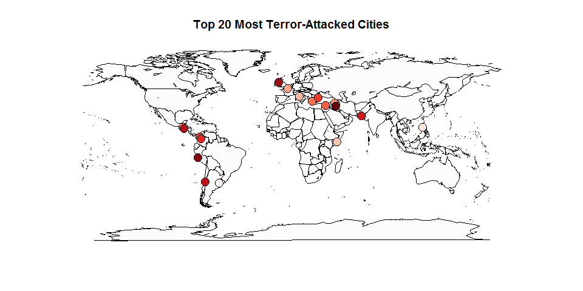

The darkest spot, in the Middle East, is Baghdad, and the other fairly dark spot in the region (at the North-West corner of Europe) is Belfast. The rest of the high intensity reds are mostly in Central/South America, and the lighter ones are in Europe.  There is also a lone point in Southeast Asia, in Manila (Philippines).

---

Before continuing, one thing that I noticed when looking at the names of those 20 cities is that I recognize a lot of them as big/capital cities.  Just out of curiosity, let's see exactly how many of those top 20 are actually the capital city of their respective country.

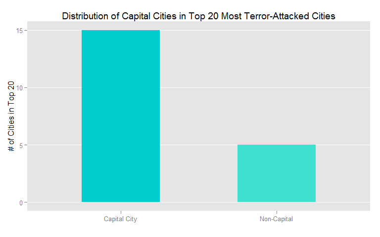

Wow, 15 out of the 20 most terror filled cities are indeed capital cities. Looks like terrorists really choose cities of high impact (duh..).

---

Next I would like to plot the intensity of how dangerous each world region is recently. We will look at data since year 2000 (inclusive), and shade each region with an intensity of red. Unlike with the cities, where the intensities were divided into 20 uniform intervals, now I want to actually see how the regions compare in absolute terms, so the colour intensities will be given according to how many attacks happened, not just according to the region's rank. Think heatmap.
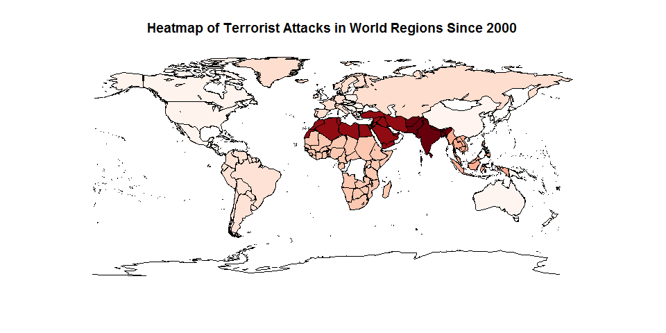

This shows pretty clearly how the Middle East and South Asia are so much worse off in terms of terrorism than the rest of the world since the new millenium. The only good thing to take from this map is that at least terrorists didn't get to Anteractica yet! Although Oceania, East Asia, and North America also seem fairly safe since 2000.

### Adding GapMinder into the equation

Earlier we looked at which countries had the most terrorist attacks. Another way to look at that could be to see which countries had the most attacks relative to how big the country is. For example, if two countries have the same number of terrorism acts, but one country has 100x the population of the other, then that could be seen as valuable information. We merge data with [GapMinder](http://www.gapminder.org/) for this.  Here are the top 5.

<!-- html table generated in R 3.1.0 by xtable 1.7-3 package -->
<!-- Fri Oct 24 16:22:37 2014 -->
<TABLE border=1>
<TR> <TH> Country </TH> <TH> # Attacks </TH> <TH> Population </TH> <TH> Population Per Attack </TH>  </TR>
  <TR> <TD> El Salvador </TD> <TD align="right"> 5320 </TD> <TD align="right"> 6939688 </TD> <TD align="right"> 1304 </TD> </TR>
  <TR> <TD> Lebanon </TD> <TD align="right"> 2036 </TD> <TD align="right"> 3921278 </TD> <TD align="right"> 1926 </TD> </TR>
  <TR> <TD> Nicaragua </TD> <TD align="right"> 1968 </TD> <TD align="right"> 5675356 </TD> <TD align="right"> 2884 </TD> </TR>
  <TR> <TD> Iraq </TD> <TD align="right"> 7807 </TD> <TD align="right"> 27499638 </TD> <TD align="right"> 3522 </TD> </TR>
  <TR> <TD> Israel </TD> <TD align="right"> 1618 </TD> <TD align="right"> 6426679 </TD> <TD align="right"> 3972 </TD> </TR>
   </TABLE>

Iraq seems to be the only country that is both in the top 5 most attacked and top 5 most attacked per population. Note also how all these countries are either in the Middle East or South America.

---

Now let's see if there's any correlation between a country's GDP and its terrorism history.

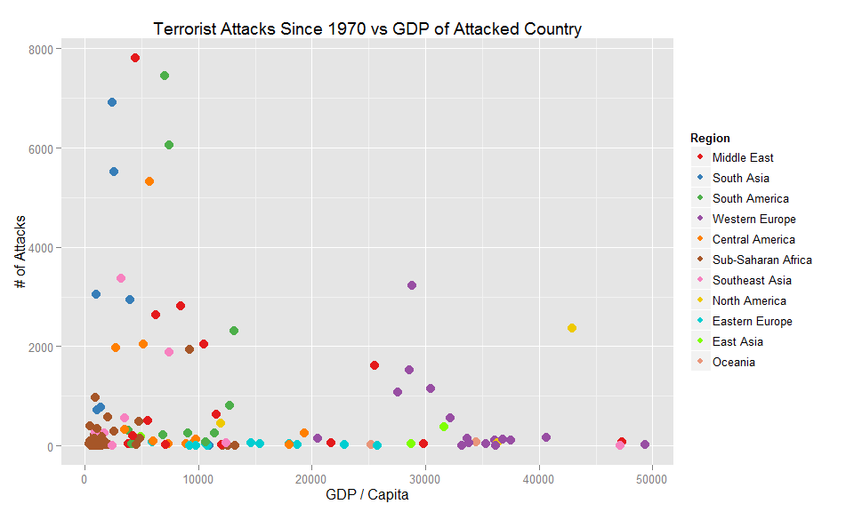

This plot reveals, perhaps as we would have expected, that the countries with the most terrorist attacks are usually poorer countries. We can see that there are perhaps two outliers here, I would say that the two dots above 2000 attacks that are at the richer side seem to be outliers. By running `subset(countryAttacksGapMinder, totAttacks > 2000 & gdpPercap > 27000))`, we get to see which countries those are: Spain and the US. This means that the US and Spain have a fairly high number of terror acts compared to other countries with a similarly high GDP.

---

Next, I'd like to see the 100 deadliest terror attacks worldwide, and again see the correlation with GDP (since most attacks happen in poorer countriest, it is statistically expected to see more deadly attacks there as well).

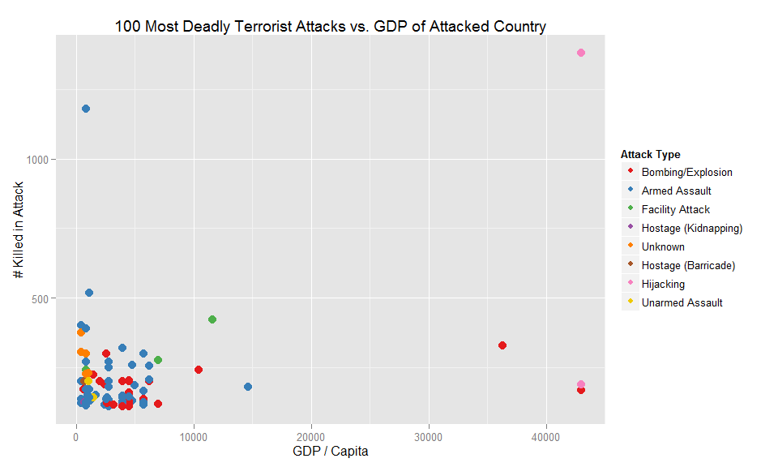

Looking at this plot, we see (as suspected) that most of the 100 deadliest attacks were in poorer countries. It seems like with the exception of 4 attacks, the rest are all in countries with a lower GDP/cap than 15000. The few clear intereting outliers here are the two hijackings and two bombings/explosions that we see on the right at 2 rich countries, and the single armed assault with over 1000 fatalities.  
Let's take a look at what attacks these were.

<!-- html table generated in R 3.1.0 by xtable 1.7-3 package -->
<!-- Fri Oct 24 16:22:38 2014 -->
<TABLE border=1>
<TR> <TH> Country </TH> <TH> Year </TH> <TH> Month </TH> <TH> Day </TH> <TH> City </TH> <TH> Attack Type </TH> <TH> # Killed </TH> <TH> # Wounded </TH>  </TR>
  <TR> <TD> Canada </TD> <TD align="right"> 1985 </TD> <TD align="right">   6 </TD> <TD align="right">  23 </TD> <TD> Toronto </TD> <TD> Bombing/Explosion </TD> <TD align="right"> 329.00 </TD> <TD align="right"> 0.00 </TD> </TR>
  <TR> <TD> Rwanda </TD> <TD align="right"> 1994 </TD> <TD align="right">   4 </TD> <TD align="right">  13 </TD> <TD> Gikoro </TD> <TD> Armed Assault </TD> <TD align="right"> 1180.00 </TD> <TD align="right"> 0.00 </TD> </TR>
  <TR> <TD> United States </TD> <TD align="right"> 2001 </TD> <TD align="right">   9 </TD> <TD align="right">  11 </TD> <TD> New York City </TD> <TD> Hijacking </TD> <TD align="right"> 1381.50 </TD> <TD align="right"> 0.00 </TD> </TR>
  <TR> <TD> United States </TD> <TD align="right"> 2001 </TD> <TD align="right">   9 </TD> <TD align="right">  11 </TD> <TD> New York City </TD> <TD> Hijacking </TD> <TD align="right"> 1381.50 </TD> <TD align="right"> 0.00 </TD> </TR>
  <TR> <TD> United States </TD> <TD align="right"> 1995 </TD> <TD align="right">   4 </TD> <TD align="right">  19 </TD> <TD> Oklahoma City </TD> <TD> Bombing/Explosion </TD> <TD align="right"> 168.00 </TD> <TD align="right"> 650.00 </TD> </TR>
  <TR> <TD> United States </TD> <TD align="right"> 2001 </TD> <TD align="right">   9 </TD> <TD align="right">  11 </TD> <TD> Arlington </TD> <TD> Hijacking </TD> <TD align="right"> 189.00 </TD> <TD align="right"> 0.00 </TD> </TR>
   </TABLE>

We will analyze these one by one:
- First, the single outlier among the poor counties is Rwanda. This is part of the Rwandan genocide in 1994. I'm not sure why this specific point is there, but the other 100,000s of people killed in that time are not in the data.  
- Looking at the other 4 points, we realize they are actually 5 rows -- not 4 -- but two of them are the exactly same point and therefore are hiding each other. These 5 rows are only 3 separate events though.  
- Three of these come from 9/11 - the two towers are represented as two events, and the crash into the Pentagon is the third one.  Looking at the actual data, we see that the authors of the database chose to take a reported number of casualties from the two towers and simply divide it by 2 to assign each tower an equal number of people. This is probably why the number of people killed is a fraction (1381.5).  
- The other attack was also in the US; it's the Oklahoma City Bombing.  
- The last very deadly attack in a developed country comes from Canada, and it is the 1985 Air India flight bombing. This is the largest mass murder in Canadian history.

### Terrorism in Israel

Here I chose to look into some statistics about terrorism in Israel, and mainly suicide bombings.  This data is interesting to me because I grew up in Tel Aviv and would always hear about bombings or other terrorist activity nearby.  Around the beginning of 2001, what is known as the "Second Intifada" started, and that period of violence can be clearly seen in the plots as large spikes in bombing activity. Since the situation got a little scary, my parents decided to leave the country and move to Canada in 2002.

---

First I want to look at the frequency of each type of terrorist attack. We will use a pie chart to visualize this.

We can see bombings are by far the #1 most common attack, with armed assault and assassinations as the only significant runner ups.

---

Another important piece of information to look at is which attacks resulted in the most casualties.

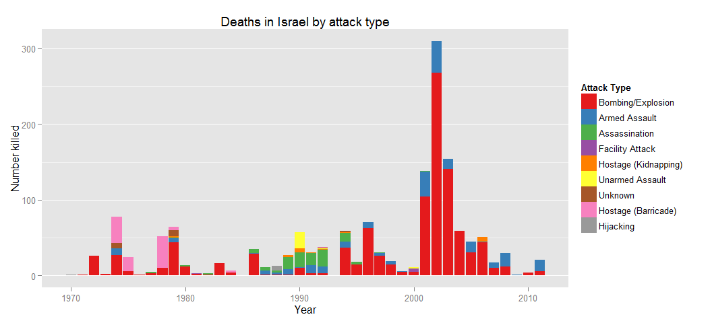

We can see that bombings indeed killed the most people over the years (although it seems like there were a few big deadly hostage situations in the 70's). The onstart of the Intifada in the early 2000's is esily seen in this plot, in the columns representing bombings and assaults.

---

Since suicide bombing is the most prominent terrorist attack in Israel with the most casualties resulting from it, I want to see how many people got wounded and killed from such bombings.

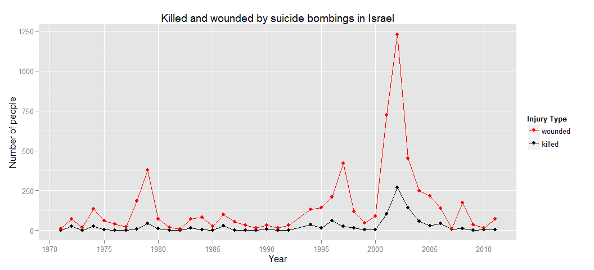

This plot reveals again the escalation in bombings in the early 2000's, just before my dad decided to leave.

---

The last thing I want to look at is how many bombings happened in the city where I grew up, while I was growing up there. I make a bar graph for this, comparing bombings in Tel Aviv vs the rest of Israel each year since my birth until my arrival to Canada.

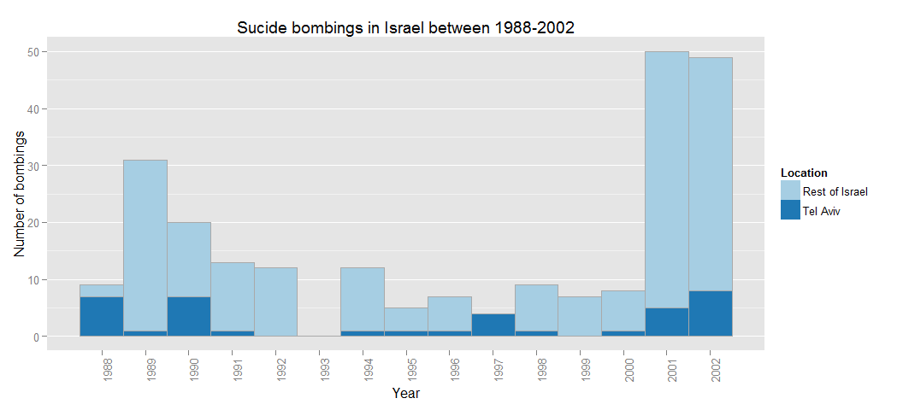

It looks like out of almost 100 bombings in 2001-2002, over 10 of them were in Tel Aviv.

---

_Just as a side note, 1993 was NOT some magical year of peace. All data from 1993 was lost and not recovered by the providers of this dataset._
